# Technical Spec — Excel Data-Analyst Agent

**Status:** Draft v2 · **Scope:** Single-user / internal tool · **Owner:** Ryan

> v2 change: local-first. No Postgres, no S3, no queue, no SessionStore adapter. Everything lives under `~/.da-agent` and the SDK's native local JSONL sessions.

---

## 1. Goal

An AI agent that ingests Excel files (1+ files, 1+ sheets), understands schema and cross-sheet relationships, answers questions from trivial lookups to multi-step inference, produces new artifacts (tables, charts, sheets), and runs an end-to-end Senior Data Analyst workflow. Built on the **Claude Agent SDK** with the **xlsx** skill, persisting everything to the **local filesystem**.

---

## 2. Key Decisions

| Topic | Decision | Rationale |
|---|---|---|
| Tenancy | Single-user, local | No auth/isolation needed |
| Storage | Local dir `~/.da-agent` (KB + artifacts) | No S3 |
| Sessions | SDK **default local JSONL** (`CLAUDE_CONFIG_DIR → ~/.da-agent/sessions`) | No Postgres, no custom adapter |
| Code execution | SDK local runtime (optional single Docker container for isolation) | No pool — local + local-JSONL removes the multi-host rationale |
| KB preprocessing | **Opus subagent (`kb_profiler`)** → markdown memory note per file | No queue/broker; agent reads memory note not raw bytes |
| Output target | New `.xlsx` / New `.pptx` / New `.docx` (standalone) · New sheet · Pick sheet (KB-bound) | Agent **asks when ambiguous**; all writes under `outputs/<session_id>/<output_id>/` |
| Google Sheets | CRUD via Sheets API (OAuth) | Import as KB / export results |

---

## 3. Architecture

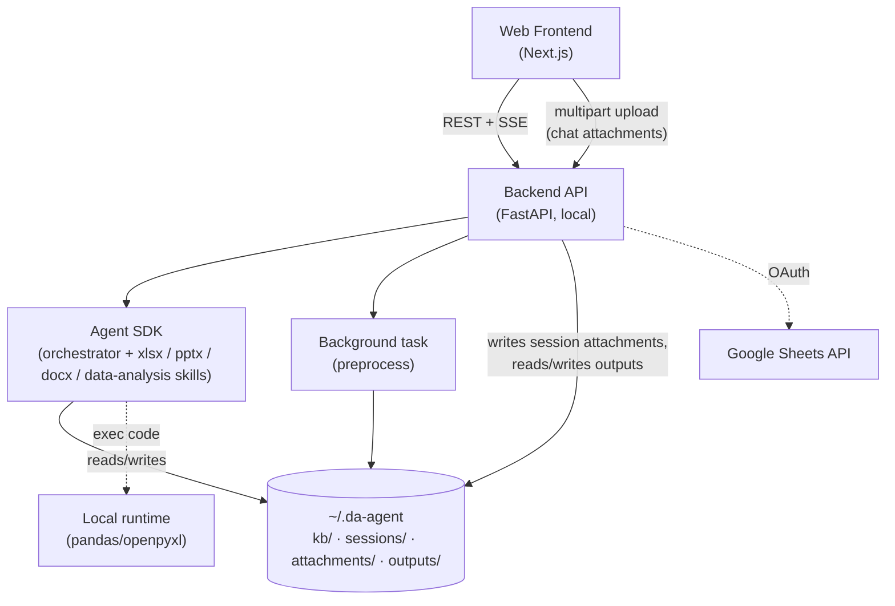

**Boundary rule (unchanged, the core idea):** the LLM never receives raw spreadsheet bytes. It receives the **memory note** (markdown schema/profile written by `kb_profiler` subagent) and operates on data through **code executed in the runtime** (data pushdown). This caps token usage independent of file size.

---

## 4. Filesystem Layout

`~/.da-agent` *is* the database.

```
~/.da-agent/
├── config.toml
├── kb/
│   └── <kb_id>/
│       ├── raw.xlsx              # original (immutable)
│       ├── versions/             # non-destructive edits
│       │   ├── v2.xlsx
│       │   ├── v2.meta.json      # sidecar: which sheet(s) the agent added/overwrote in v2
│       │   └── …
│       └── cache/                # optional parquet/csv for fast pandas reads
├── agent-memory/
│   └── kb_profiler/
│       └── <kb_id>.md            # kb_profiler memory note (replaces deprecated manifest.json)
├── outputs/                      # standalone artifacts not bound to any KB
│   ├── registry.json             # global output registry
│   └── <session_id>/
│       └── <output_id>/
│           ├── <filename>        # model-supplied; filename-only shown in chat
│           └── meta.json
├── attachments/                  # short-term per-session uploads (chat composer)
│   └── <session_id>/
│       └── <att_id>/<filename>
└── sessions/                     # SDK JSONL transcripts (CLAUDE_CONFIG_DIR)
    └── projects/<project>/<session_id>.jsonl
```

`attachments/` lives at the data-root level (parallel to `sessions/`) to avoid colliding with the SDK's `sessions/projects/<project>/<id>.jsonl` layout. `Settings` exposes `kb_dir`, `sessions_dir`, `outputs_dir`, and `attachments_dir` as derived paths under `data_root`.

**Configuration env vars** (all prefixed `DA_AGENT_`, parsed in `src/da_agent/config.py`):

| Env var | Setting | Default | Reference |
|---|---|---|---|
| `DA_AGENT_HOME` | `data_root` | `~/.da-agent` | §4 |
| `DA_AGENT_MODEL` | `model` | `databricks-claude-sonnet-4-6` | §10 |
| `DA_AGENT_MAX_TURNS` | `max_turns` | unset (SDK default) | §8 |
| `DA_AGENT_PLAN_FIRST` | `plan_first` | `False` | §8.3 |
| `DA_AGENT_SHOW_THINKING` | `show_thinking` | `True` | §8.6 |
| `DA_AGENT_STREAM` | `stream_responses` | `True` | §8.6 |
| `DA_AGENT_ATTACHMENT_MAX_BYTES` | `attachment_max_bytes` | `100 MiB` | §5.3 |
| `DA_AGENT_SCOPE_WARN_BYTES` | `scope_warn_bytes` | `256 KiB` | §8.5 |
| `DA_AGENT_OUTPUTS_DIR` | `outputs_dir` | derived from `data_root` | §4 |
| `DA_AGENT_ATTACHMENTS_DIR` | `attachments_dir` | derived from `data_root` | §4 |
| `DA_AGENT_KB_PROFILER_MEMORY_DIR` | `kb_profiler_memory_dir` | `~/.da-agent/agent-memory/kb_profiler` | §5.1 |
| `DA_AGENT_KB_PROFILER_MODEL` | `kb_profiler_model` | default opus model id | §5.1 |
| `DA_AGENT_CORS_ORIGINS` | (env-only, no settings field) | `""` — CORS origin allowlist for FastAPI | §13.5 |

> Note: `workspace_dir` is **DEPRECATED** — kept for backcompat, NOT in `add_dirs`, NOT created by `ensure_dirs()`.

---

## 5. Input & Ingestion

Two ingestion paths, distinguished by **frontend entry point** and **lifetime**. Long-term ingest goes through preprocessing; short-term ingest does not.

| Path | Frontend entry | Lifetime | Preprocessing | Storage | Agent access |
|---|---|---|---|---|---|
| **KB (long-term)** | KB Manager screen — "Add file" / "Import from Sheets" | Persistent, reused across sessions | Yes — see §5.1, status `PENDING → PROFILING → READY \| READY_PARTIAL \| FAILED` | `kb/<kb_id>/raw.xlsx` + `agent-memory/kb_profiler/<kb_id>.md` | Reads memory note; xlsx skill for ad-hoc inspection |
| **Session attachment (short-term)** | Chat screen — drop file into composer | One session (deleted with the session) | **No** — the file is dropped as-is | `attachments/<session_id>/<att_id>/<filename>` | Direct read via xlsx skill (no memory note); referenced per-turn (see §8.5) |

The two paths never cross: a chat upload is never preprocessed into a KB silently, and a KB file is never copied into the session workdir. Promoting an attachment to KB is a deliberate user action on the KB Manager screen (out of scope for this spec).

### 5.1 Preprocessing Pipeline (kb_profiler subagent — memory-driven)

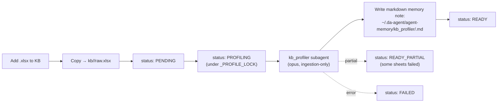

#### 5.1.1 Algorithm details

- **kb_profiler subagent.** A dedicated opus-class subagent (`kb_profiler`) runs ingestion-only — it is NOT included in `build_subagents()` and is NOT dispatched per-turn. The main analyst never sees `kb_profiler`; only the ingestion runner invokes it.
- **Output.** Free-form **markdown memory note** at `~/.da-agent/agent-memory/kb_profiler/<kb_id>.md`. Replaces the legacy `manifest.json` artifact wholesale (no structured schema; the markdown is what the agent reads on each turn).
- **Concurrency cap.** `_PROFILE_LOCK = Semaphore(1)` — at most one profiler runs at a time across the host (opus is expensive; serial profiling is acceptable).
- **Crash recovery.** `KbRegistry.load()` sweeps any leftover `PROFILING` rows to `FAILED("interrupted by restart")` on boot, then flushes the registry so a second boot is consistent. Legacy `PROCESSING` rows from older registries are also reset to `FAILED` for forward-compat. No automatic retry; user re-uploads or re-profiles via endpoint below.
- **READY_PARTIAL.** When the profiler finishes but reports per-sheet failures (e.g. unreadable sheet, schema parse error), status lands on `READY_PARTIAL`. `raw.xlsx` is still usable — the agent will read it directly via the xlsx skill on demand. The memory note may be missing or partial.

#### 5.1.2 KB Profiler Endpoints

| Method | Endpoint | Behavior |
|---|---|---|
| GET | `/kb/files/{id}/memory` | Return the markdown memory note for a KB. `409` if status is `PROFILING`; `404` if the file is missing on disk. |
| POST | `/kb/files/{id}/reprofile` | Clear the existing memory note and re-schedule `kb_profiler`. Idempotent; returns `202 Accepted`. Status transitions `READY|READY_PARTIAL|FAILED → PENDING → PROFILING`. |
| GET | `/kb/files/{id}/manifest` | **`410 Gone`** — endpoint deprecated. Use `/memory` instead. The `manifest.json` artifact is no longer written by the active pipeline. |

### 5.2 Edge Cases

| Edge case | Handling |
|---|---|
| Huge files (many rows/cols) | Never load full sheet into context. Profile via streaming/sampling. All aggregation in pandas. Row caps on previews. |
| Multiple tables in one sheet | **Region-detection** pass: scan for contiguous non-empty blocks separated by blank row/col gaps; emit each as a `region` with its own header + range. |
| Merged cells / messy headers | Multi-row header collapse heuristic; flag low-confidence regions for the agent to inspect. |
| Mixed types in a column | dtype = `mixed`; coerce at analysis time in code. |

### 5.3 Short-term attachments (chat upload)

Files dropped into the chat composer are uploaded once and live for the lifetime of their session. They bypass preprocessing entirely — small, throwaway, ad-hoc.

**Endpoint:** `POST /sessions/{sid}/attachments` (multipart). Response:

```jsonc
{
  "attachment_id": "att_01HRZ…",   // ulid; stable for the session lifetime
  "filename": "draft.xlsx",         // original, sanitized (path components stripped)
  "size_bytes": 18422,
  "mime": "application/vnd.openxmlformats-officedocument.spreadsheetml.sheet",
  "uploaded_at": 1748332751.0       // epoch seconds (float), matches created_at/updated_at elsewhere
}
```

**Storage:** `~/.da-agent/attachments/<session_id>/<att_id>/<filename>`. The `<att_id>` directory isolates filename collisions (two `report.xlsx` uploads coexist).

**Lifetime:** tied to the session — deleted when `DELETE /sessions/{sid}` is called; also wipes `outputs/<sid>/` recursively. Forking a session (`POST /sessions/{sid}/fork`) does NOT copy attachments; the fork starts empty (parent's attachments would otherwise drift between branches).

**How the agent sees them:** the attachment file lives on the SDK's `add_dirs` (per-session, see §8.5). The agent reads it the same way it reads any file in its working directory. No manifest is generated; the model uses the xlsx skill on demand.

**Sequence — chat upload then send:**

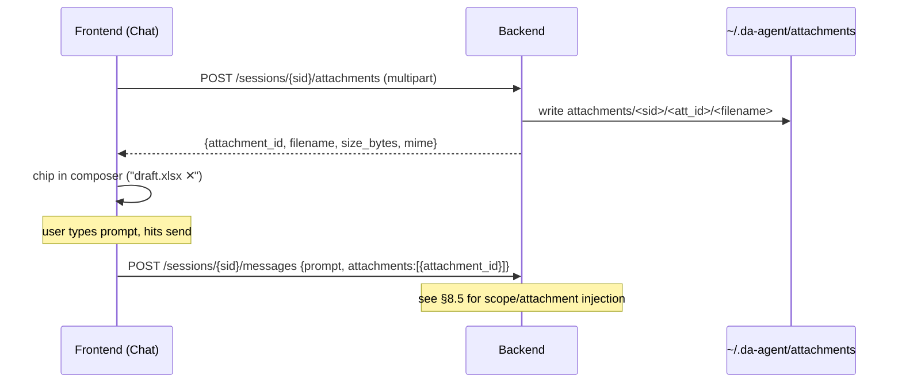

**Edge cases:**

| Case | Handling |
|---|---|
| File >100 MB (config: `attachment_max_bytes`) | Reject with `413 Payload Too Large`. Big files belong in KB. |
| Non-xlsx mime | Accept any mime that the xlsx skill or a future skill can read; do not gate by extension. The agent figures it out. |
| Duplicate filename in same session | Different `att_id` directories — no collision on disk. FE may show both chips with disambiguating size/timestamp. |
| Attachment referenced by `attachment_id` that doesn't exist | `POST /messages` returns `400` with `unknown attachment_id` (see §8.5 validation). |
| Session deleted while attachment dir is large | Recursive delete is best-effort; failures are logged and the session record is removed regardless (orphan dirs are swept on next start). |

---

## 6. Session Persistence

Use the SDK's **default local behavior** — no adapter, no DB. Set `CLAUDE_CONFIG_DIR=~/.da-agent/sessions` so transcripts live with the tool's data. `query()`, `resume`, `continue`, `fork`, `listSessions`, and `delete` all operate on local JSONL out of the box.

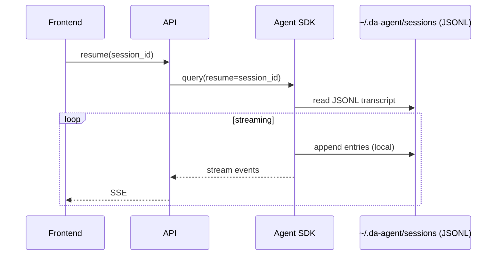

No `mirror_error` concerns, no compaction-vs-raw split to manage at the storage layer — local JSONL is the single source of truth. Subagent transcripts are written alongside automatically.

---

## 7. KB Management (CRUD)

- **Create:** add `.xlsx` or import a Google Sheet → triggers preprocessing.
- **Read:** list `kb/` dirs + read memory notes (`GET /kb/files/{id}/memory`); preview via reprofile if needed.
- **Update:** replace `raw.xlsx` → re-preprocess; analytic edits write to `versions/`.
- **Delete:** remove `kb/<id>/`.
- **Google Sheets:** import (Sheets API → export xlsx → ingest) and export results back to a sheet/tab.

---

## 8. Agent Design

| Capability | Mechanism |
|---|---|
| Understand schema + relationships | Reads kb_profiler memory note; xlsx skill for ad-hoc inspection |
| Simple Q&A (value lookup) | Single code call against cache/raw |
| Complex Q&A (multi-step inference) | Agent loop: plan → code → observe → synthesize |
| Create tables/charts/sheets | xlsx skill (openpyxl) |
| End-to-end analyst | **Plan Mode** + **Subagents** |

### 8.1 Analyst Orchestration

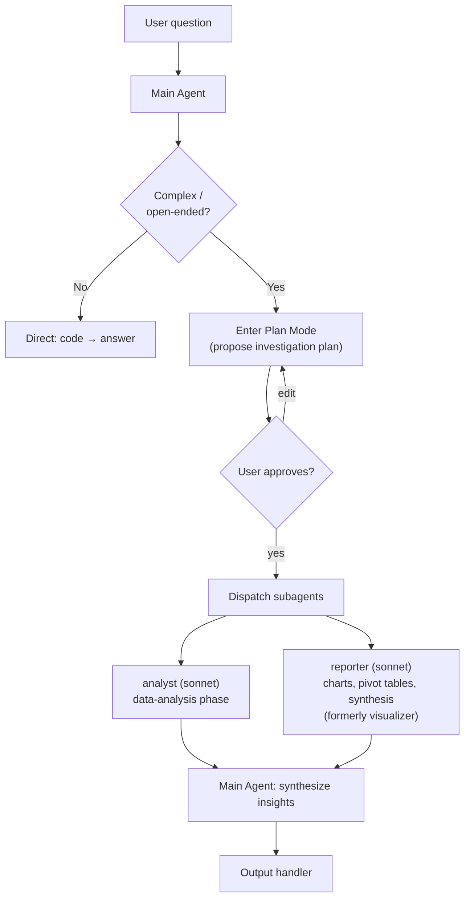

> Note: `kb_profiler` is **ingestion-only** (§5.1), NOT dispatched per-turn. Per-turn fan-out is just `analyst` + `reporter`.

### 8.2 Output Handling

When the agent is about to produce a file, it must decide *where* the bytes land. If the target is unambiguous from the user's last message ("save it as a new file") the agent writes directly. Otherwise it asks — using the same `AskUserQuestion` pipeline defined in §8.3 (no bespoke clarification tool; the placeholder `ask_output_target` is removed).

**Three targets, three filesystem destinations:**

| Option label (≤12 char) | Description shown to user | Filesystem destination | Constraints |
|---|---|---|---|
| `New .xlsx` | Download a fresh standalone file | `~/.da-agent/outputs/<session_id>/<output_id>/<filename>` | No source KB needed. |
| `New .pptx` | Download a fresh standalone presentation | `~/.da-agent/outputs/<session_id>/<output_id>/<filename>` | No source KB needed. |
| `New .docx` | Download a fresh standalone document | `~/.da-agent/outputs/<session_id>/<output_id>/<filename>` | No source KB needed. |
| `New sheet` | Append a new sheet to a source KB file | `~/.da-agent/outputs/<session_id>/<output_id>/<filename>` (output is tagged `kind=kb_version` for UI grouping; the kb_version observer branch is deprecated and returns None) | Requires picking a `kb_id`. Must not collide with an existing sheet name in that file. |
| `Pick sheet` | Overwrite/append into an existing sheet of a source KB file | `~/.da-agent/outputs/<session_id>/<output_id>/<filename>` (output is tagged `kind=kb_version` for UI grouping) | Requires picking a `kb_id` *and* a sheet name from that file's memory note. |

`raw.xlsx` is never touched. KB-bound options always copy the latest version (latest `vN.xlsx`, or `raw.xlsx` if no versions yet) into a fresh `v<N+1>.xlsx`, then mutate inside the copy — Golden Rule 4.

**Question chain (re-uses §8.3 pipeline verbatim):**

The agent emits ONE `AskUserQuestion` call with **two questions** in the same payload (the SDK schema allows 1–4 questions per call — no follow-up round-trip). The backend builds the `Source` options by **intersecting all READY KB files with the current turn's `kb_scope`** (see §8.5) — the model never sees a KB outside the turn's scope.

```jsonc
// SSE: interaction.requested (kind=question), payload sent to FE
{
  "type": "interaction.requested",
  "tool_use_id": "toolu_…",
  "kind": "question",
  "questions": [
    {
      "question": "Where should the result be written?",
      "header": "Target",                 // ≤12 chars
      "multiSelect": false,
      "options": [
        {"label": "New .xlsx",   "description": "Download a fresh standalone file"},
        {"label": "New sheet",   "description": "Add a new sheet to a source KB file"},
        {"label": "Pick sheet",  "description": "Write into an existing sheet of a source KB file"}
      ]
    },
    {
      "question": "Which KB file (and sheet, if applicable)?",
      "header": "Source",                 // ≤12 chars
      "multiSelect": false,
      // Backend intersects READY KB ∩ kb_scope; format "kb_<id>" for whole file,
      // "kb_<id>::<sheet>" for a specific sheet. FE shows nice labels; backend
      // strips back to ids when resolving. Always include "N/A" for the New .xlsx target.
      "options": [
        {"label": "Sales.xlsx",          "description": "Whole file (for: New sheet)"},
        {"label": "Sales.xlsx / Q1",     "description": "Sheet Q1 (for: Pick sheet)"},
        {"label": "Sales.xlsx / Q2",     "description": "Sheet Q2 (for: Pick sheet)"},
        {"label": "N/A",                 "description": "Choose if target is New .xlsx"}
      ]
    }
  ]
}
```

The model receives the answer through the standard `tool_result` flow defined in §8.3. The backend validates the (Target, Source) pair before resuming the SDK:

| Target chosen | Required `Source` shape | Validation on backend |
|---|---|---|
| `New .xlsx` | `N/A` | accept any |
| `New sheet` | `kb_<id>` (whole file) | `kb_<id>` exists, status=READY, in turn's `kb_scope` |
| `Pick sheet` | `kb_<id> / <sheet>` | sheet present in that file's memory note (`GET /kb/files/{id}/memory`) |

If validation fails, the backend returns `PermissionResultDeny(message="invalid target: …", interrupt=False)` — the model sees the error in `tool_result` and can re-emit the question (the §8.3 loop already handles malformed answers).

**Output registration:**

After the agent finishes writing, a backend tool-observer (same pattern as `TodoStore` in §8.4) detects the write site and calls `outputs.register(...)`:

- For `New .xlsx` / `New .pptx` / `New .docx`: mints `output_id = out_<ulid>`, writes file under `outputs/<session_id>/<output_id>/<filename>`, writes `meta.json`, emits SSE.
- For `New sheet` / `Pick sheet`: also routes to `outputs/<session_id>/<output_id>/<filename>` (NOT `kb/<kb_id>/versions/` directly — the `kb_version` observer branch is deprecated and returns `None`). The output is still tagged `kind=kb_version` in metadata for UI grouping. The download URL routes through the standard outputs endpoint.

**`outputs/<session_id>/<output_id>/meta.json` schema:**

```jsonc
{
  "output_id": "out_01HRZ…",          // ulid
  "session_id": "sess_…",              // session this output belongs to (path component)
  "kind": "standalone",                // "standalone" | "kb_version"
  "title": "Q1 sales summary",         // model-supplied or filename-derived
  "filename": "Q1_sales_summary.xlsx", // on disk under outputs/<session_id>/<output_id>/
  "mime": "application/vnd.openxmlformats-officedocument.spreadsheetml.sheet",
  "size_bytes": 18422,
  "source_session_id": "sess_…",       // session that produced it
  "source_kb_ids": [],                 // empty for standalone; populated if model copied data from KBs
  "created_at": "2026-05-27T08:11:02Z"
}
```

**`kb/<kb_id>/versions/v<N>.meta.json` schema** (sidecar for KB-bound writes):

```jsonc
{
  "version": "v3",                     // matches v3.xlsx
  "parent_version": "v2",              // or "raw" if first version
  "kind": "kb_version",
  "operation": "add_sheet",            // "add_sheet" | "overwrite_sheet"
  "sheet_affected": "Q1_summary",      // sheet name added or overwritten
  "source_session_id": "sess_…",
  "created_at": "2026-05-27T08:11:02Z"
}
```

**Sequence — output target resolution + write + register:**

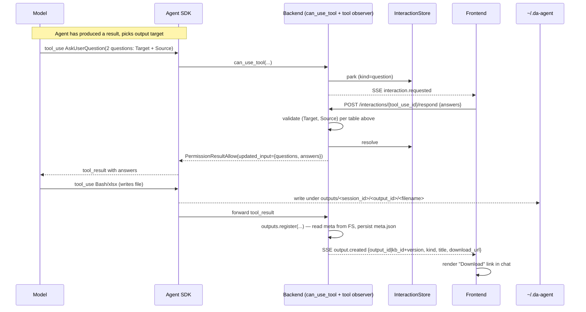

A new SSE event type, `output.created`, is added to the list in §11. Frontends MUST treat unknown event types as no-ops (forward-compat clause already in §11 — no new policy).

### 8.3 Interactive User Loop (Plan & Question)

Two SDK tools — `AskUserQuestion` and `ExitPlanMode` — pause the agent until the user responds. In a web deployment the backend wraps the SDK with a `can_use_tool` callback that intercepts these tools, parks the call as a pending **interaction**, and pushes a request to the frontend over SSE. The frontend submits the answer over REST; the backend resolves the awaited future, and the SDK resumes the agent in place.

The current CLI reuses the same seam (see `agent/permissions.py::make_can_use_tool`) — the web pipeline only swaps the in-process UI Protocol for SSE + REST adapters; no SDK semantics change.

> Note: `AskUserQuestion` and `ExitPlanMode` are SDK **built-in** tools (not custom MCP tools); they are intercepted in `agent/permissions.py::make_can_use_tool`. The legacy `agent/tools.py` module has been removed.

**Pipeline components:**

| Component | Role |
|---|---|
| `can_use_tool(tool_name, tool_input, ctx)` | Backend gate. Awaits a `Future` for `AskUserQuestion` and `ExitPlanMode`; returns `PermissionResultAllow()` for everything else without prompting. |
| `InteractionStore` | In-memory map `{session_id: {tool_use_id → PendingInteraction}}` holding `kind` (`question` / `plan`), payload, and `Future`. Lives in the FastAPI process; not persisted. |
| SSE channel on `/sessions/{id}/messages` | Pushes a fresh `interaction.requested` event whenever the gate parks a call. |
| `POST /sessions/{id}/interactions/{tool_use_id}/respond` | Frontend submits the answer; backend resolves the matching `Future`, removes the entry, and the SDK resumes immediately. |
| `GET /sessions/{id}/interactions/pending` | Reconnect/refresh recovery — returns any unresolved entries so the frontend can re-render their modals. |
| SSE `interaction.resolved` | Emitted by backend after `/respond` is processed; FE pops the matching `pendingInteraction[tool_use_id]` entry. |

**Sequence — `AskUserQuestion`:**

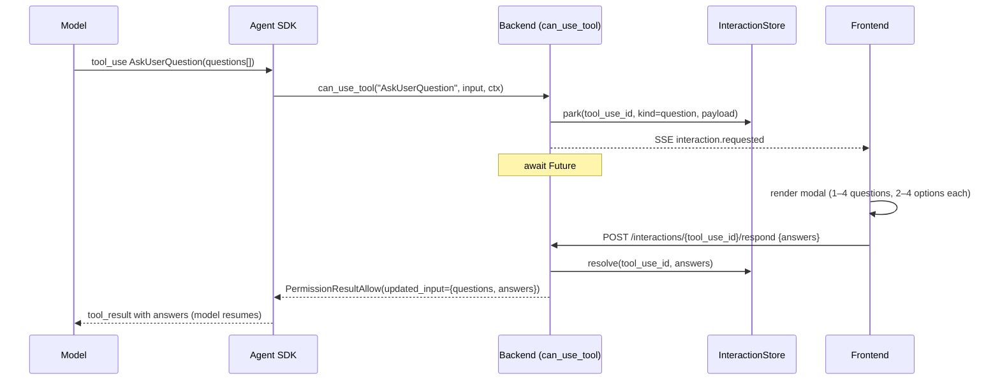

**Sequence — `ExitPlanMode`:**

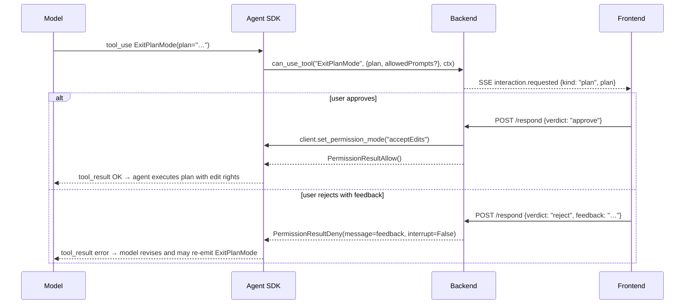

**`AskUserQuestion` — wire payload:**

```jsonc
// SSE event sent to the frontend
{
  "type": "interaction.requested",
  "tool_use_id": "toolu_01ABC...",
  "kind": "question",
  "questions": [
    {
      "question": "Where should the chart be saved?",
      "header": "Output",                 // ≤12 chars (chip label, per SDK schema)
      "multiSelect": false,
      "options": [
        {"label": "New .xlsx",   "description": "Download a fresh file"},
        {"label": "Source file", "description": "Add as a new sheet"},
        {"label": "In place",    "description": "Edit, write to versions/"}
      ]
    }
  ]
}
```

```jsonc
// REST body — POST /sessions/{id}/interactions/{tool_use_id}/respond
{
  "answers": [
    {"header": "Output", "selected": ["New .xlsx"], "other_text": null}
  ]
}
```

```jsonc
// Backend feeds back to the SDK as updated_input
{
  "questions": [ /* verbatim from the tool call */ ],
  "answers": { "Where should the chart be saved?": "New .xlsx" }
}
```

The `answers` map keys each entry by the original `question` text and joins `selected` (plus `other_text` if present) with `", "`. This shape matches the SDK's expectation when it receives the `tool_result` — the model sees a clean prose reply.

**`ExitPlanMode` — wire payload:**

```jsonc
// SSE
{
  "type": "interaction.requested",
  "tool_use_id": "toolu_…",
  "kind": "plan",
  "plan": "1. Profile Sales sheet…\n2. Aggregate by month…\n3. Render chart…",
  "allowedPrompts": [{"tool": "Bash", "prompt": "run tests"}]
}

// REST — approve
{ "verdict": "approve" }

// REST — reject with revision hint
{ "verdict": "reject", "feedback": "skip step 3 for now" }
```

**Edge cases:**

| Case | Handling |
|---|---|
| Frontend refresh / reconnect mid-question | `InteractionStore` is in-memory and survives the websocket drop. On reconnect, the frontend calls `GET /interactions/pending` and re-renders the unresolved entries. |
| User dismisses the modal | Frontend MUST send a response. For a question, an empty `selected` is converted by the backend into `PermissionResultDeny(message="user declined to answer", interrupt=False)`; for a plan, send `{verdict: "reject", feedback: "user dismissed"}`. The model gets a clean signal instead of hanging. |
| Multiple questions in one call (1–4) | Single SSE event, single REST response with one `Answer` per `header`. |
| Free-text "Other" | Frontend appends `other_text` to the `selected` list before sending; backend joins both into the answer string. |
| Two interactions queued back-to-back | Each has a unique `tool_use_id`; frontend keeps a queue and renders them sequentially. |
| Backend restart while a `Future` is awaited | The SDK call is lost. The backend should respond `503` to the next message attempt and require the user to retry the turn. (Persisting interactions across restarts is an open question — see §14.) |
| Timeout | No automatic timeout: the agent is genuinely waiting on the user. A long-idle warning in the UI is a UX choice, not a backend kill. |

### 8.4 Todo List Streaming Pipeline

The agent plans multi-step work via the SDK's task tools — `TaskCreate`, `TaskUpdate`, `TaskGet`, `TaskList` — plus the legacy `TodoWrite`. The frontend renders this as a live checklist that mirrors the agent's internal plan. Each tool call is observed by a backend `TodoStore` (see `agent/todos.py`) which derives an immutable `TodoSnapshot` and pushes it to the frontend over SSE. The store is reset at the start of every user turn.

**Frontend invariant:** rows are added/updated/removed *only* in response to a snapshot derived from a **completed** task tool. The frontend never speculates from a `tool_use` alone — it waits for the matching `tool_result` to land before mutating its render. This guarantees a row never disappears mid-flight (e.g. the agent emits `TaskUpdate(deleted)` but the SDK fails to apply it) and that `TaskCreate` rows only appear once the SDK has assigned an id.

**Pipeline components:**

| Component | Role |
|---|---|
| `TodoStore` (backend) | Observes `tool_use` + `tool_result` blocks for the task tools. Internal state: `_tasks: dict[task_id, TodoItem]`, `_order: list[task_id]`, `_pending_creates: dict[tool_use_id, dict]`. |
| Snapshot derivation | After any state-changing tool *result*, the store emits `TodoSnapshot(items=…)` to the SSE channel as a `todos.snapshot` event. Snapshots are full state, not deltas — idempotent and safe to drop. |
| Turn reset | At the top of `AgentRunner.send`, `TodoStore.reset()` is called and an empty snapshot is pushed before `client.query()`. This keeps todos turn-scoped (matches the CLI semantics). |

**Lifecycle:**

```
TaskCreate(tool_use)            → park in _pending_creates, no snapshot
TaskCreate(tool_result "Task #N created successfully: <subject>")
                                → parse id (regex), upsert TodoItem(status=PENDING),
                                  push snapshot
TaskUpdate(tool_use, status=in_progress|completed)
                                → mutate item.status, push snapshot
TaskUpdate(tool_use, status=deleted)
                                → remove from _tasks/_order, push snapshot
TaskGet / TaskList              → read-only, no snapshot
TodoWrite(tool_use, todos=[…])  → rewrite all items, push snapshot
turn boundary                   → reset(), push empty snapshot
```

The SDK CLI emits `TaskCreate` results as a **plain string** of the form `"Task #<id> created successfully: <subject>"`, so the store extracts the id with `r"Task\s*#(\S+)\s+created successfully"` first, then falls back to JSON (`task.id` / `id`) and finally to `local-<tool_use_id>` to keep the row identifiable.

**Sequence:**

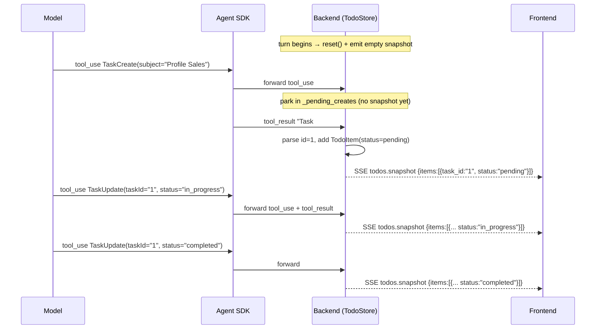

**Snapshot payload:**

```jsonc
{
  "type": "todos.snapshot",
  "session_id": "sess_…",
  "items": [
    {
      "task_id": "1",
      "subject": "Profile Sales",
      "active_form": "Profiling Sales",   // present continuous, shown while in_progress
      "status": "in_progress",            // pending | in_progress | completed
      "description": ""
    }
  ]
}
```

A **deletion** is conveyed implicitly: the next snapshot omits the row. The frontend diffs by `task_id` and removes any row not present.

**Frontend rendering rules:**

- Persistent overlay (bottom-anchored), separate from the message stream — does not scroll with chat history.
- Glyphs: `✔` completed · `▪` in_progress · `□` pending.
- For the single in-progress task, replace the spinner label with that task's `active_form`.
- Render rows ONLY from `todos.snapshot` events — never from raw `tool.use` events.

**Edge cases:**

| Case | Handling |
|---|---|
| `TaskUpdate` arrives before its `TaskCreate` result | Synthesize a stub `TodoItem` (subject empty, `active_form` empty) keyed by `taskId`; the later create result fills `subject`. |
| `TaskCreate` result string can't be parsed | Use `local-<tool_use_id>` as the id. The model can only `TaskUpdate` with the id the SDK gave it back, so unmatched updates are dropped silently — acceptable failure mode. |
| Legacy `TodoWrite` mixed with `Task*` | `TodoWrite` rewrites the entire snapshot (input field `todos` with `content` → `subject`, `activeForm` → `active_form`, `status`). Both paths share the same `TodoSnapshot` shape downstream. |
| Frontend reconnect mid-turn | On reconnect, the backend re-emits the current snapshot once. No replay of historical snapshots — the latest is authoritative. |
| Status the model invents (e.g. `"blocked"`) | Coerced via `TodoStatus(status_raw)`; on `ValueError`, the item keeps its previous status. |
| Very long task lists | The overlay caps display to N rows (configurable, default 8); overflow shows `… +K more`. The snapshot itself is uncapped. |

### 8.5 Per-turn Data Scope

The agent does not operate over "all files on disk". Each turn carries an explicit **scope** assembled by the frontend and validated by the backend. Scope has two channels:

- **KB scope** — a list of KB ids the user has ticked on the chat screen. Default (omitted/null) = **all KB files with status=READY**. Files in non-READY status are never reachable in this turn even if their id is supplied.
- **Attachments** — short-term files uploaded for this session via §5.3. The user picks which attachments come along on this turn.

**KB lifecycle status** (now an explicit field on `GET /kb/files`):

| Status | Meaning | Checkable on chat screen? |
|---|---|---|
| `PENDING` | Just uploaded, preprocess not started | No |
| `PROFILING` | `kb_profiler` subagent running | No |
| `READY` | Memory note written at `~/.da-agent/agent-memory/kb_profiler/<kb_id>.md` | **Yes** |
| `READY_PARTIAL` | Profiler completed with partial data (some sheets failed); `raw.xlsx` still usable | **Yes** (with warning) |
| `FAILED` | Profiler errored; reason on `KbMeta.error` | No |

The frontend disables (greys out) checkboxes for non-READY rows and shows the status as a chip. Polling/refresh is the FE's responsibility — the spec does not mandate a status SSE channel for it (open question, §14).

**Extended `MessageRequest` body** (`POST /sessions/{sid}/messages`):

```jsonc
{
  "prompt": "compare Q1 vs Q2 and chart the delta",
  // OPTIONAL. Omitted or null → all READY KB files (default-all).
  // Empty array → 400 (use omission, not [], to mean "default-all"; see edge cases).
  "kb_scope": ["kb_123", "kb_456"],
  // OPTIONAL. Omitted or null → no short-term attachments injected this turn.
  "attachments": [{"attachment_id": "att_01HRZ…"}]
}
```

Both new fields are **optional** — existing clients that send only `{prompt}` keep working (default-all KB, no attachments). This is the only backwards-compat surface.

**Validation rules** (executed before the SDK is started for the turn):

| Rule | Status | Body |
|---|---|---|
| `kb_scope` is `[]` (empty array) | `400` | `{"error": "kb_scope cannot be empty; omit the field for default-all"}` |
| `kb_scope` references unknown id | `400` | `{"error": "unknown kb_id: <id>"}` |
| `kb_scope` references non-READY id | `400` | `{"error": "kb <id> is in status <X>; only READY files can be scoped"}` |
| `attachments[].attachment_id` not found in this session | `400` | `{"error": "unknown attachment_id: <id>"}` |
| Same `attachment_id` twice | `400` | `{"error": "duplicate attachment_id"}` |

**Injection mechanism — prepended scope block:**

`AgentRunner.send` builds a per-turn context block and prepends it to the user prompt before calling `client.query()`. Reasons:

1. The SDK's `add_dirs` is constructor-time today; rebuilding per turn requires either restarting the client or relying on undocumented dynamics.
2. The context block lands in the local JSONL transcript — debuggable, replayable, visible to subagents.
3. KB memory notes are tiny (Golden Rule 1: memory note in, code-pushdown out) — the cost of including N of them per turn is bounded.

The block is composed as:

```
<scope>
For this turn, only these KB files are in scope:
- kb_123 (Sales.xlsx) — memory note at /…/agent-memory/kb_profiler/kb_123.md
- kb_456 (Inventory.xlsx) — memory note at /…/agent-memory/kb_profiler/kb_456.md

Short-term attachments (no memory note, read directly with xlsx skill):
- /…/attachments/<sid>/att_…/draft.xlsx
</scope>

<user_prompt>
compare Q1 vs Q2 and chart the delta
</user_prompt>
```

When `kb_scope` is omitted/null, the block lists every READY KB. When `attachments` is omitted/null, the second sub-list is omitted. The system prompt (`build_system_prompt`) instructs the model that anything not in the `<scope>` block is off-limits for this turn.

**`add_dirs` strategy:** the SDK still gets `add_dirs=[kb_dir, attachments_dir/<sid>, outputs_dir]` at construction time so the filesystem is *reachable*. `workspace_dir` is **excluded from `add_dirs`** (deprecated). The scope block is what *bounds* the model's attention. This separation matters: a model that ignores the scope instruction still cannot write to a KB outside scope (the can_use_tool / Golden-Rule-4 layer prevents it), but it also cannot read other KBs because the scope tells it which memory-note paths to consult — the others are never named.

**Sequence — message turn with explicit scope:**

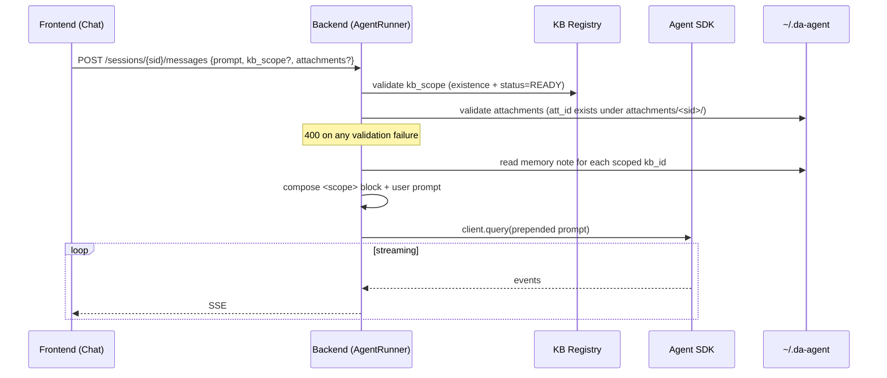

**Edge cases:**

| Case | Handling |
|---|---|
| `kb_scope: []` | `400` (see validation table). Empty list is ambiguous — force the client to be explicit. |
| `kb_scope` field absent vs. `kb_scope: null` | Both treated as default-all. |
| User checks a KB, FE sends turn, KB transitions READY → FAILED mid-turn | Validated at turn start; mid-turn transitions are not detected. Acceptable — reprofile re-runs are not destructive (overwrite `<kb_id>.md` memory note; agent re-reads on next turn). |
| Scope changes between turns of the same session | Allowed — each turn has its own `<scope>` block. The transcript records both. |
| Very large scope (e.g. 100 KBs default-all) | Manifests are bounded per Golden Rule 1, but the assembled block can still be sizable. Soft cap: log a warning if total manifest bytes >`scope_warn_bytes` (default 256 KB). Hard cap is an open question (§14). |
| Attachment referenced but not on disk (race with delete) | Treated like unknown attachment_id → `400`. |

---

### 8.6 Streaming Output (token-level)

The agent surfaces partial assistant content via the SDK's `StreamEvent` channel
(`include_partial_messages=True`). Goal: typing-cursor UX and sub-second
time-to-first-byte for `assistant.text` / `assistant.thinking` blocks. Tool
results, structured outputs, and `AskUserQuestion`/`ExitPlanMode` payloads are
NOT streamed (see §8.3, §8.5).

**Enablement.** `Settings.stream_responses: bool = True` (env `DA_AGENT_STREAM`).
Set on `ClaudeAgentOptions` in `agent/core.py::_build_options`. When False, the
backend falls back to atomic `assistant.text` / `assistant.thinking` SSE events
(below). When the SDK suppresses `StreamEvent` (e.g. `max_thinking_tokens` is
set), the same fallback path engages transparently.

**Backend dispatch.** `agent/core.py::_render` adds a `StreamEvent` branch:

| `event.type` | Action |
|---|---|
| `message_start` / `message_delta` / `message_stop` | no-op |
| `content_block_start` (text \| thinking) | mint `block_id` (`txt_<12hex>` / `thk_<12hex>`); store in per-turn map keyed by SDK `index` |
| `content_block_start` (tool_use) | buffer `tool_use_id`; no UI emit |
| `content_block_delta` (`text_delta`) | `ui.on_text_delta(block_id, delta.text)` |
| `content_block_delta` (`input_json_delta`) | drop in v1; reserved for `on_tool_input_delta` |
| `content_block_stop` | `ui.on_text_end(block_id)` / `ui.on_thinking_end(block_id)` |

**Suppression rule.** When at least one delta has fired for a content block,
the eventual full `TextBlock` / `ThinkingBlock` in the trailing `AssistantMessage`
is NOT re-rendered (no double `assistant.text`). The full `ToolUseBlock` always
re-renders through `on_tool_use` — streaming is purely additive observability
on tool input, never replaces the dispatch path. `_INTERACTIVE_TOOLS` ∪
`TODO_TOOL_NAMES` filter (§8.4) applies unchanged.

**Subagents (v1).** `StreamEvent.parent_tool_use_id != None` → drop. The full
subagent `AssistantMessage` still renders into the subagent lane (UI-UX §7.6.1)
via the existing `parent_tool_use_id` path. Token-level streaming inside the
lane is deferred (see §14).

**Wait label coordination.** `WebAgentUI` emits `wait.end` on the first
`on_text_delta` of a turn; `wait.begin("Running <tool>")` resumes per
`_render_block`. Anti-flicker invariant from §8.4 (begin_wait → todos.reset →
empty snapshot) is preserved — the triplet runs before `client.query()`,
streaming begins inside `receive_response()`.

**`AgentUI` Protocol additions** (`ui/base.py`, all sync, mirror existing render
methods):

- `on_text_delta(block_id: str, delta: str) -> None`
- `on_text_end(block_id: str) -> None`
- `on_thinking_delta(block_id: str, delta: str) -> None`
- `on_thinking_end(block_id: str) -> None`

`block_id` is server-minted and opaque to the FE (`txt_<12hex>` / `thk_<12hex>`),
generated at `content_block_start` and held in a per-turn `dict[int, str]` keyed
by the SDK's `index`. Both `ConsoleAgentUI` and `WebAgentUI` MUST implement
these methods. CLI prints deltas inline (no newline) and flushes on `*_end`;
the existing 600-char thinking truncation moves into a buffered accumulator
released on `on_thinking_end`.

**SSE wire (replaces line 781 — see §11).**

| Event | Payload |
|---|---|
| `assistant.text.delta` | `{block_id, text, parent_tool_use_id?}` |
| `assistant.text.end` | `{block_id}` |
| `assistant.thinking.delta` | `{block_id, text, parent_tool_use_id?}` |
| `assistant.thinking.end` | `{block_id}` |
| `assistant.text` (atomic) | fallback only, when streaming off |
| `assistant.thinking` (atomic) | fallback only, when streaming off |

`parent_tool_use_id` is reserved for v1.1 (subagent lane streaming); not present
in v1 payloads. FE treats absent === null === main stream.

**Sequencing guarantees.**

1. `interaction.requested` cannot interleave with deltas — `can_use_tool` only
   fires on the complete `ToolUseBlock`, which arrives after `content_block_stop`
   for the preceding text block.
2. `tool.result` always lands between two text blocks; chain detection
   (UI-UX §7.2) is unaffected.
3. No delta fires after `result` for that turn.

**Per-turn event sequence example:**

```
wait.begin {label: "Thinking"}
todos.snapshot {items: []}
assistant.text.delta   {block_id: "txt_a1...", text: "Loading"}
assistant.text.delta   {block_id: "txt_a1...", text: " the manifest…"}
assistant.text.end     {block_id: "txt_a1..."}
tool.use               {name: "Bash", input: {...}, depth: 0}
wait.begin             {label: "Running Bash"}
tool.result            {summary: "...", is_error: false}
assistant.text.delta   {block_id: "txt_a2...", text: "Found 3 sheets."}
assistant.text.end     {block_id: "txt_a2..."}
result                 {turns, cost_usd, duration_s}
wait.end
```

**Failure modes.**

- Mid-stream FE disconnect → no replay; FE recovers via banner (UI-UX §6.4)
  and treats the next delta with a fresh `block_id` as a new paragraph.
- Server crash mid-turn → unchanged from today (turn lost).
- SDK regression suppressing `StreamEvent` → atomic fallback engages
  transparently (per-turn `_streamed_blocks` set stays empty).
- Out-of-order or cross-block delta interleaving → SDK contract forbids; backend
  logs and ignores any late delta.

---

### 8.7 Session history loading & resume

**Problem.** Reopening a session in the FE should populate the chat scrollback
with prior turns instead of an empty pane. Live SSE only carries events for the
*current* turn; the JSONL transcript on disk is the authoritative record of
everything before it.

**`SessionMeta.sdk_session_id`.** A new optional field (`str | None`) on
`SessionMeta`, persisted in `<data_root>/registry.json`. Captured from the SDK's
`SystemMessage(subtype="init")` on the first turn of a session and reused on
every subsequent turn. Legacy registries without the field load with `None` via
`SessionMeta.from_dict` default.

**Capture mechanism.** `WebAgentUI.__init__` accepts an optional
`on_sdk_session_id: Callable[[str], None]` callback. `WebAgentUI.on_system`
invokes it whenever `subtype == "init"` and `data["session_id"]` is a non-empty
string. The route layer (`server/routes/messages.py:_ensure_runner`) wires the
callback to `state.registry.set_sdk_session_id(sid, sdk_uuid)` via
`asyncio.create_task` — fire-and-forget with `add_done_callback` to swallow
exceptions cleanly. `set_sdk_session_id` is idempotent (no flush when the value
is unchanged), so repeated `init` events on the same session are cheap.

**Resume on subsequent inits.** `AgentRunner` accepts a kwarg
`resume_sdk_session_id: str | None`. `_build_options()` passes it through as
`ClaudeAgentOptions(resume=...)` so the SDK reuses the existing JSONL
transcript instead of opening a fresh session UUID. `_ensure_runner` reads the
value off `runtime.meta.sdk_session_id` when constructing the runner.

**Endpoint** `GET /sessions/{sid}/messages` → `MessageHistoryResponse(events: list[dict])`:

- `404` when the session id is unknown.
- `200` with empty `events` when `sdk_session_id is None` (no runner has ever
  connected — fresh session).
- Otherwise reads JSONL via `claude_agent_sdk.get_session_messages(sdk_uuid)`
  (offloaded to `asyncio.to_thread` since it is sync filesystem I/O), translated
  through `replay_to_events`. The SDK helper is called with `directory=None` so
  it scans every project dir under `CLAUDE_CONFIG_DIR/projects/` — passing
  `project_root` would silently miss the JSONL on path-NFC / symlink / worktree
  mismatches.

**Replay translator** (`server/replay.py:replay_to_events`):

| Source | Emitted event(s) |
|---|---|
| `user` role with `str` content | `result(turns=N-1, cost_usd=null, duration_s=0)` boundary if not the first turn, then `user.prompt` |
| `user` role with list of `tool_result` blocks | one `tool.result` per block (`depth=0`, summary via `_stringify_tool_result`, `tool_use_id` preserved) |
| `assistant` role `text` block | `assistant.text` (skip whitespace-only) |
| `assistant` role `thinking` block | `assistant.thinking` (skip whitespace-only) |
| `assistant` role `tool_use` block | `tool.use` IF `name not in _INTERACTIVE_TOOLS` (= `{AskUserQuestion, ExitPlanMode}` ∪ `TODO_TOOL_NAMES`); other types skipped |

A trailing synthetic `result(turns=N, cost_usd=null, duration_s=0)` is appended
after the last assistant turn so the FE reducer flips `inToolChain=false` and
marks open thinking blocks `done`. Every emitted dict carries `session_id=sid`
to match the live SSE wire shape — the FE folds replay events through the same
`streamReducer` with zero new render code.

**Lifespan env mirror.** `server/app.py` lifespan sets
`os.environ["CLAUDE_CONFIG_DIR"] = str(settings.sessions_dir)` on enter and
restores the previous value on exit. The SDK subprocess already has the same
value baked into its env (via `ClaudeAgentOptions.env`); the parent FastAPI
process needs the mirror because `claude_agent_sdk.get_session_messages` reads
`CLAUDE_CONFIG_DIR` from `os.environ` directly. Without the mirror, history
loads would miss any JSONL the subprocess just wrote.

**JSONL flush race.** The SDK writes JSONL asynchronously after the live
`result` event reaches the client. If the FE GETs `/messages` immediately after
a turn ends, the trailing `assistant.text` block may still be missing on disk.
In practice users click the sidebar to revisit a session minutes after the
turn — the race is theoretical. v1 documents this as a known limitation; no
automatic mitigation.

**Default session name.** `"Untitled"` (capitalized) is applied consistently in
`CreateSessionRequest` default, `SessionMeta.from_dict` fallback, and
`SessionRegistry.create`. (Earlier drafts used lowercase `"untitled"`.)

**Sequence — open an existing session:**

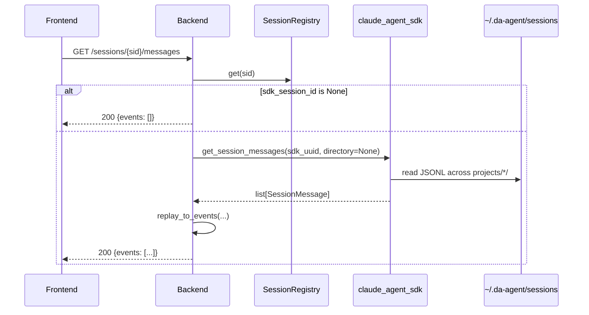

---

## 9. Frontend

Simple local web app. Suggested: **Next.js + React + Tailwind**, streaming via SSE.

| Page | Function |
|---|---|
| Chat | Stream agent turns; plan-mode approval modal; AskUserQuestion modal; live todo-list overlay; show tool/subagent activity; download outputs; **KB scope picker (READY rows checkable, others greyed); short-term file upload (drop-zone in composer)** |
| KB Manager | Add / import-from-Sheets / list / re-sync / delete; view memory note; **show file status (`PENDING` / `PROFILING` / `READY` / `READY_PARTIAL` / `FAILED`)** |
| Sessions | List, resume, rename, fork, delete |

---

## 10. Tech Stack

| Layer | Choice |
|---|---|
| Agent / Backend | Python, **Claude Agent SDK**, FastAPI |
| Skills | Anthropic **xlsx** / **pptx** / **docx** / **data-analysis** skills (pandas, openpyxl, python-pptx, python-docx, etc.) |
| Execution | SDK local runtime (optional single Docker container for isolation) |
| Storage | Local filesystem `~/.da-agent` |
| Sessions | SDK default local JSONL (`CLAUDE_CONFIG_DIR`) |
| Integrations | Google Sheets API (OAuth) |
| Frontend | Next.js + React + Tailwind, SSE |

*Dropped vs v1: Postgres, S3, Celery/RabbitMQ, custom SessionStore adapter, container pool.*

---

## 11. Core API Surface

| Method | Endpoint | Purpose |
|---|---|---|
| POST | `/kb/files` | Add xlsx → trigger preprocess |
| POST | `/kb/files/import-sheet` | **Stub returning `501 Not Implemented`** — Google Sheets import deferred (§14 OAuth open question) |
| GET | `/kb/files` | List KB files |
| GET | `/kb/files/{id}/manifest` | **`410 Gone`** — deprecated; use `/memory` |
| GET | `/kb/files/{id}/memory` | Return `kb_profiler` markdown memory note (`409` if `PROFILING`; `404` if missing) |
| POST | `/kb/files/{id}/reprofile` | Re-trigger `kb_profiler` subagent (`202 Accepted`) |
| DELETE | `/kb/files/{id}` | Delete KB dir |
| POST | `/sessions` | Create session |
| GET | `/sessions` · `/sessions/{id}` | List / resume metadata |
| GET | `/sessions/{sid}/messages` | Replay prior turns as a list of SSE-shape event dicts (`{events: list[dict]}`). 404 if `sid` unknown; empty `events` for fresh sessions. See §8.7. |
| POST | `/sessions/{id}/messages` | Send turn (SSE stream back). Body: `{prompt, kb_scope?, attachments?}` — see §8.5 for shape and validation. |
| POST | `/sessions/{sid}/attachments` | Upload a short-term file for the session (multipart). Returns `{attachment_id, filename, size_bytes, mime, uploaded_at}` (`uploaded_at` is epoch seconds). |
| GET  | `/sessions/{sid}/attachments` | List attachments for a session. |
| DELETE | `/sessions/{sid}/attachments/{att_id}` | Remove a single attachment. |
| POST | `/sessions/{id}/interactions/{tool_use_id}/respond` | Resolve a paused interaction (`AskUserQuestion` answers or `ExitPlanMode` verdict) |
| GET | `/sessions/{id}/interactions/pending` | List unresolved interactions (used on reconnect/refresh to re-render modals) |
| POST | `/sessions/{id}/fork` | Fork |
| DELETE | `/sessions/{id}` | Delete session; recursively removes `attachments/<sid>/` AND `outputs/<sid>/` |
| GET  | `/outputs` | List standalone outputs (kind=standalone). Query: `?session_id=…` filter (default: filter by current session; toggle "All sessions" to omit filter). |
| GET  | `/outputs/{output_id}` | Download standalone file (streams `outputs/<session_id>/<output_id>/<filename>`). |
| GET  | `/outputs/{output_id}/meta` | Return `meta.json` for a standalone output. |
| DELETE | `/outputs/{output_id}` | Remove `outputs/<session_id>/<output_id>/`. |
| GET  | `/kb/files/{kb_id}/versions` | List versions (`v2`, `v3`, …) with sidecar meta. |
| GET  | `/kb/files/{kb_id}/versions/{version}/download` | Download a specific KB version (used as the download URL for `kind=kb_version` outputs). |

**SSE event types** emitted on `POST /sessions/{id}/messages`: `assistant.text.delta`, `assistant.text.end`, `assistant.thinking.delta`, `assistant.thinking.end`, `assistant.text` (fallback), `assistant.thinking` (fallback), `tool.use`, `tool.result`, `system`, `result`, `interaction.requested`, `interaction.resolved`, `todos.snapshot`, `output.created`, `wait.begin`, `wait.end`, `error`. See §8.6 for streaming semantics. Frontends MUST treat unknown event types as no-ops (forward-compat).

---

## 12. Golden Rules

1. **LLM never sees raw bytes.** Memory note in, code-pushdown out — caps tokens regardless of file size.
2. **Aggregation happens in pandas, not in the model.** The agent writes/executes code; it does not "read" 48k rows.
3. **Local JSONL is the single source of truth** for sessions. Don't reinvent persistence.
4. **Writes are non-destructive.** Edits go to `versions/`; `raw.xlsx` is immutable.
5. **Ambiguous output → ask, don't guess.**

## 13. Anti-Patterns

- ❌ Dumping full sheets into the prompt "so the model has context."
- ❌ Adding a DB/queue/object-store for a single-user local tool.
- ❌ Overwriting `raw.xlsx` in place.
- ❌ Treating one sheet as one table (breaks on multi-region sheets).
- ❌ Auto-resolving `AskUserQuestion` / `ExitPlanMode` without user input (defeats the human-in-the-loop guarantee — see §8.3 and Golden Rule 5).
- ❌ Rendering todo rows from `tool.use` events alone — wait for the `todos.snapshot` derived from the matching `tool_result` (see §8.4).
- ❌ Hardcoding a placeholder tool like `ask_output_target` instead of `AskUserQuestion` (breaks the §8.3 pipeline; FE has no modal for it).
- ❌ Writing standalone outputs anywhere other than `~/.da-agent/outputs/<session_id>/<output_id>/` (frontend download URL becomes guesswork).
- ❌ Mutating an existing `v<N>.xlsx` in place when adding/overwriting a sheet — always copy → `v<N+1>.xlsx` (preserves the non-destructive chain from Golden Rule 4).
- ❌ Letting the user check a KB whose status is not `READY` (race with the §5.1 preprocess pipeline — memory note may not exist yet, or may be rewritten by reprofile under the agent's feet).
- ❌ Treating `kb_scope: []` as "no KBs in scope" — empty list is rejected with `400`; "no KBs" is expressed by sending only attachments (with all KBs unticked through an explicit subset).
- ❌ Per-turn rebuilding of the SDK's `add_dirs` to enforce scope — use the `<scope>` system block instead (debuggable, replayable, no SDK lifecycle churn).

---

## 13.5 Security Model

Two-layer model — both must hold; neither alone is sufficient.

### Layer 1 — SDK Sandbox

Defined in `agent/security.py::build_sandbox_settings`:

- `SandboxSettings(enabled=True, autoAllowBashIfSandboxed=True, allowUnsandboxedCommands=False, excludedCommands=["curl", "wget", "ssh", "sudo", "shutdown", ...])`
- `SandboxNetworkConfig(deniedDomains=[], allowedDomains=["pypi.org", "files.pythonhosted.org", "registry.npmjs.org", "registry.yarnpkg.com", "github.com", "objects.githubusercontent.com", "raw.githubusercontent.com"], allowAllUnixSockets=False, allowLocalBinding=False)`
- The allowlist is intentionally narrow — Docker container is the host-isolation layer; the sandbox only opens egress for skill `pip install` / `npm install` and GitHub-raw skill setup scripts.

### Layer 2 — PreToolUse Bash hook + Permissions deny rules

- PreToolUse hook in `agent/security.py::inspect_bash_command` matches Bash commands; rejects shell metacharacters and dangerous patterns even if Layer 1 sandbox somehow lets them through.
- `permissions.deny[]` covers: `Write(*raw.xlsx)`, `Edit(*raw.xlsx)`, `Write(*manifest.json)`, `*sessions/**`, `~/.aws/**`, `~/.ssh/**`, `~/.config/gh/**`, `~/.netrc`, `WebFetch`, `WebSearch`. **No `allow` rules** are configured — they would clash with `AskUserQuestion`-resolved per-turn output paths.

### CORS

`DA_AGENT_CORS_ORIGINS` env var (commit 6856dc2) — comma-separated origin list; defaults to `localhost:3000` / `127.0.0.1:3000`.

### Docker isolation

`Dockerfile` + `docker-compose.yml` provided. Container pre-installs: pandas, python-pptx, python-docx, Pillow, markitdown, lxml, defusedxml, pptxgenjs (npm), docx (npm), LibreOffice. The container is the **host-isolation layer**; the sandbox `deniedDomains=[]` policy is safe because of containerization.

---

## 14. Open Questions

- Code-execution isolation: Docker container is now the default isolation layer (Dockerfile + docker-compose.yml in repo). Remaining open: whether the SDK runtime should auto-launch inside Docker or remain opt-in for local dev.
- Cleanup policy for old `versions/` and session JSONL.
- Google Sheets auth flow for a local single user (loopback OAuth vs. service account).
- Interaction state durability (§8.3): `InteractionStore` is in-memory; should pending interactions survive a backend restart, or is reload-and-resume sufficient for a single-user tool?
- Todo overlay row cap (§8.4): is a fixed cap (default 8) acceptable, or should the overlay scroll/collapse instead?
- Scope size cap (§8.5): the soft-warn cap (`scope_warn_bytes`, default 256 KiB) ships and emits a log warning when exceeded; whether to add a hard byte cap that rejects the turn outright is still open. Relevant once a user has dozens of KBs and uses default-all.
- Attachment retention (§5.3, §8.5): attachments live for the session lifetime — do we need a per-attachment TTL or size-based eviction inside a long-running session?
- KB status SSE channel (§8.5): should status transitions push to the chat screen so the checkbox un-greys without polling, or is FE-side polling sufficient?
- Output retention (§8.2): cleanup policy for `~/.da-agent/outputs/` (already adjacent to the existing `versions/` cleanup question).
- Subagent lane streaming (§8.6 + UI-UX §7.6.1): should token-level deltas with `parent_tool_use_id != None` render in the subagent lane in v1.1, or stay suppressed?
