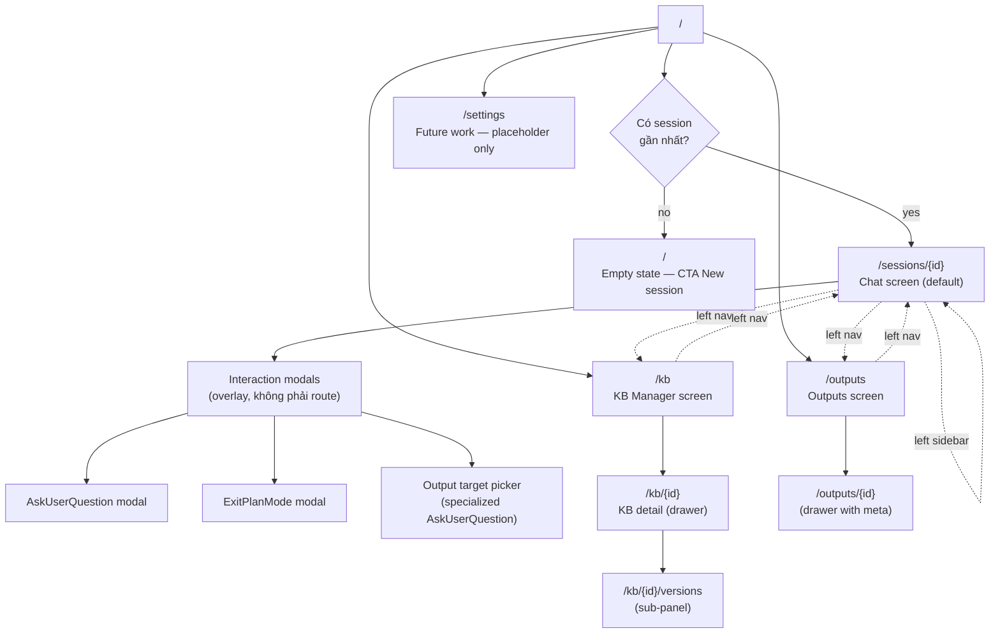
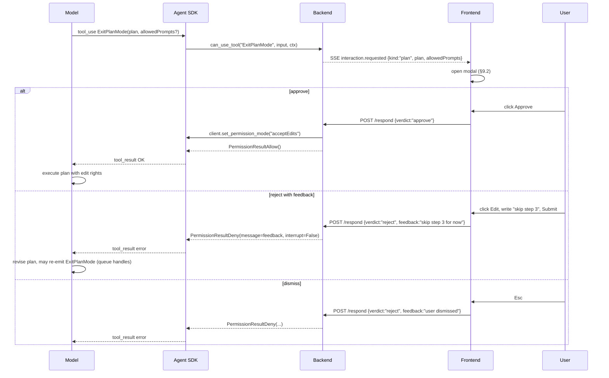
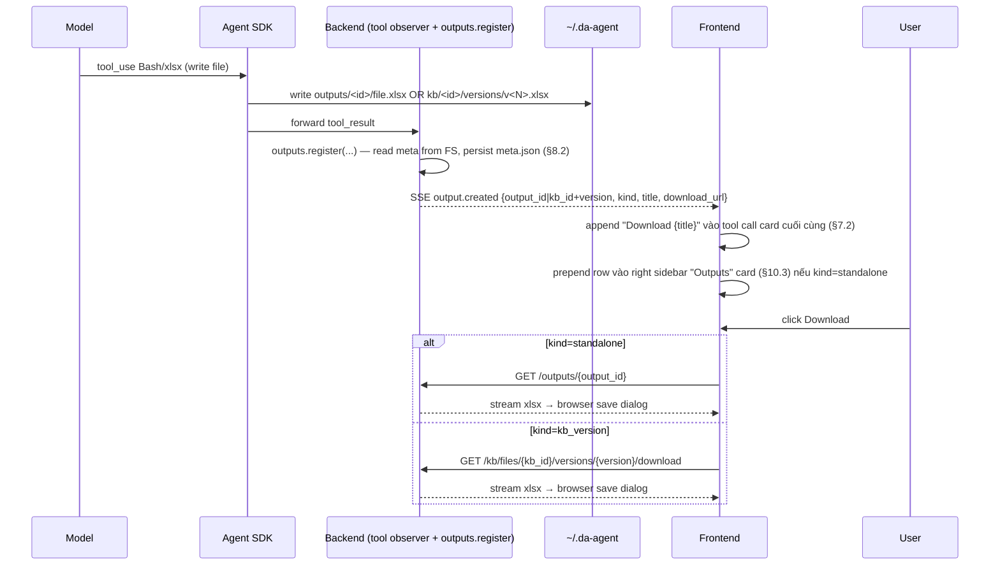

# da-agent — Frontend Design (DESIGN.md)

> Tài liệu này mô tả UI/UX cho da-agent — Excel analyst agent chạy trên Claude Agent SDK. Mọi feature/contract đều được cite ngược về `docs/technical-spec.md` bằng tag `[§N.M]`. Đây không phải design system: typography scale, color tokens, motion specs, spacing scale đã có sẵn ở pipeline khác.

---

## 1. Mục tiêu & phạm vi

**User chính:** một analyst nội bộ, single-user, local tool [§2]. Người này upload `.xlsx` vào Knowledge Base (KB), hỏi câu hỏi từ lookup đơn giản tới multi-step inference, và nhận output dưới dạng file mới hoặc sheet thêm vào KB version [§1, §8.2].

**Mục tiêu UX:**

- Cho user thấy rõ agent đang làm gì (thinking, tool calls, todos) mà không làm ngập màn hình.
- Mỗi turn user phải biết: scope dữ liệu nào đang dùng, attachment nào đã đính kèm, kết quả output đi về đâu.
- Interactive prompts từ agent (`AskUserQuestion`, `ExitPlanMode`) phải block-rõ, không bị trôi mất trong stream [§8.3].
- Resume / fork / reconnect phải trong suốt — user không mất context vì F5 [§6, §8.3].

**Non-goals của tài liệu này:**

- Color tokens, typography scale, spacing scale, motion timing — design system riêng.
- Internationalization tokens — copy tiếng Anh, chưa scope localization.
- Mobile breakpoints — desktop-first single-user tool [§2].
- Visual mockups pixel-perfect — ở đây mô tả structure, behavior, states.

Tham chiếu: `docs/technical-spec.md` (Draft v2, Single-user / internal tool).

---

## 2. Information Architecture (sitemap)



Sitemap chỉ có 3 productive screens cho MVP: **Chat** (chính), **KB Manager**, **Outputs**. `/settings` được giữ làm placeholder để nav stable nhưng không có tính năng — tập trung resource cho các flow KB + data analysis (§4.4).

Mọi screen đều reach được qua **left sidebar nav** (xem §5). Modals là overlay, không có URL riêng — chúng được trigger bởi SSE event `interaction.requested` [§8.3, §11], hoặc bởi `GET /sessions/{id}/interactions/pending` khi reconnect.

---

## 3. Layout system

Mọi screen của app dùng cùng một **3-pane shell** để điều hướng nhất quán. Chỉ phần **main column** thay đổi theo route; left/right sidebar có behavior riêng tùy screen.

| Pane | Width rough | Sticky elements | Collapsible? |
|---|---|---|---|
| Left sidebar | 240–280px | Top: brand + nav tabs. Bottom: empty (no profile chip — single-user local tool, MVP không cần auth UI). | Có — collapse → 56px icon-only rail. |
| Main column | flex (min 640px) | Top: page header (sticky). Bottom: page action bar (composer / table toolbar). | Không bao giờ ẩn. |
| Right sidebar | 280–320px | Top: collapse toggle + section title. | Có — collapse → toggle pill ở mép phải. |

**Resize behavior:**

- Khi viewport <1024px: right sidebar tự động collapse (vẫn mở được manual).
- Khi viewport <768px: left sidebar collapse về icon-only rail; right sidebar ẩn hoàn toàn (single-user desktop tool, mobile không phải scope chính).
- Cả hai sidebar có thể được collapse manual qua icon ở header. Trạng thái persist trong `localStorage` per route group.

**Sticky chain trong Chat screen:**

```
┌───────────┬──────────────────────────────┬──────────────┐
│ Brand +   │ Session header (sticky top)  │ Resources    │
│ collapse  ├──────────────────────────────┤ toggle       │
│           │                              ├──────────────┤
│ + New     │  Message stream              │ Card: Scope  │
│ session   │  (scrollable)                │ Card: Attach │
│           │                              │ Card: Outputs│
│ Recents   │  [Floating scroll-to-bottom] │ Card: Todos  │
│  • A      │                              │              │
│  • B      ├──────────────────────────────┤              │
│  • C      │ Notice banner (optional)     │              │
│           ├──────────────────────────────┤              │
│ + Upload  │ Composer (sticky bottom)     │              │
│   to KB   │                              │              │
│           │                              │              │
│           │                              │              │
└───────────┴──────────────────────────────┴──────────────┘
```

Right sidebar trên các screen khác (`/kb`, `/outputs`) thường ẩn mặc định — dùng full-width main cho table; user mở khi cần preview/inspect.

---

## 4. Screen catalog

### 4.1 Chat screen (`/sessions/{id}`) — default landing

Default route khi session gần nhất tồn tại. Component chính: header (§6.1), message stream (§6.2 + §7), composer (§8), notice banner (§6.4), right sidebar (§10). Đây là nơi user dành ~90% thời gian.

### 4.2 KB Manager screen (`/kb`)

Quản lý long-term KB files. Table view với polling status [§5.1, §8.5]. Click row → drawer detail. Xem §11 cho mô tả đầy đủ.

### 4.3 Outputs screen (`/outputs`)

List tất cả standalone outputs (`kind=standalone`) — không bao gồm `kb_version` (xem qua KB detail) [§8.2, §11]. Filter theo session. Xem §12.

### 4.4 Settings (`/settings`) — Future work

Route reserved nhưng KHÔNG implement trong MVP. Main column hiển thị một full-screen placeholder duy nhất:

```
┌────────────────────────────────────────────────────────┐
│                                                        │
│                    Settings                            │
│                    Future work                         │
│                                                        │
│   Local-user single-tenant tool — chưa có cấu hình     │
│   nào cần expose ở UI. Toàn bộ config sống ở           │
│   ~/.da-agent/config.toml.                             │
│                                                        │
│   [ Open config.toml in OS file manager ]              │
│                                                        │
└────────────────────────────────────────────────────────┘
```

- KHÔNG có theme toggle, KHÔNG có user profile, KHÔNG có preference panel — tất cả đẩy về Future work để MVP tập trung vào KB + chat + analysis flows.
- Button "Open config.toml" optional, chỉ là một deep-link tiện ích nếu host environment cho phép `file://` open.
- Nav item "Settings" trong left sidebar (§5) vẫn render để route shell ổn định nhưng đánh chip "Future" đứng cạnh label.

### 4.5 Cross-screen navigation

User di chuyển giữa các screen qua **left sidebar nav** (mục §5). Mỗi screen giữ nguyên left sidebar nhưng main + right thay đổi:

- Click "Knowledge Base" trong left nav → `/kb` (main = table; right sidebar ẩn).
- Click "Outputs" trong left nav → `/outputs`.
- Click một session trong "Recents" → `/sessions/{id}`.
- Click "+ New session" → `POST /sessions` [§11] → redirect `/sessions/{id}` mới tạo.
- Click "+ Upload to KB" trong left sidebar (shortcut) → mở `/kb` với upload modal pre-opened.

URL deep-linkable: paste link → app load đúng state (session/KB/output).

---

## 5. Left sidebar (cross-screen)

Left sidebar persistent qua mọi screen. Nội dung từ trên xuống:

1. **Brand + collapse toggle** (sticky top): logo "da-agent" + chevron icon thu gọn sidebar.
2. **Primary nav** (icon + label):
   - "Chat" → mở session active (hoặc empty state).
   - "Knowledge Base" → `/kb`.
   - "Outputs" → `/outputs`.
   - "Settings" → `/settings` — render kèm chip nhỏ `Future` để báo placeholder, vẫn click được nhưng dẫn tới placeholder screen (§4.4).
3. **"+ New session"** button — prominent, full-width, ngay trước "Recents". Click → `POST /sessions` [§11] → redirect.
4. **Section "Recents"** (Sessions):
   - List session từ `GET /sessions` [§11], sort theo `updated_at` desc.
   - Mỗi item: tiêu đề (max 1 dòng + ellipsis) + active dot indicator nếu là session hiện tại.
   - Active item: bold + dot bên trái.
   - Hover: hiện kebab menu (3-dot) → menu items: Rename / Fork / Delete.
     - Rename → inline editable text trong item.
     - Fork → `POST /sessions/{id}/fork` [§11] → redirect tới session mới (không copy attachments [§5.3]).
     - Delete → confirm modal → `DELETE /sessions/{id}` [§11].
   - Click item: switch session (thay đổi route).
   - Empty state: "No sessions yet" + CTA "+ New session" inline.
   - Cap hiển thị 50 sessions; "Show more" expand list.
5. **"+ Upload to KB"** link — phụ trợ shortcut tới KB Manager với upload modal mở sẵn. Đây là cách nhanh nhất từ chat screen để add thêm KB mà không mất context.
6. **Sticky bottom: bỏ trống.** MVP không có user profile chip / sign-in / org switcher — đây là single-user local tool, mọi cấu hình tới `~/.da-agent/config.toml`. Vùng này được giữ làm khoảng đệm để Recents list không cấn vào mép cửa sổ; có thể thêm version footer (`da-agent v0.x`) caption nhỏ nếu cần.

**Collapsed state (icon-only rail, 56px):**

- Brand → biểu tượng rỗng/logo.
- Nav tabs → icon only, hover tooltip. "Settings" giữ nguyên icon (Future chip ẩn ở collapsed, chỉ xuất hiện ở expanded để giảm noise).
- Recents → giấu (chevron hover-out để mở popover list).
- "+ New session" → biểu tượng `+`.

---

## 6. Main column — Chat screen

### 6.1 Session header (sticky top)

- Title = session name (mặc định derived từ first prompt; user rename inline). Click title → trở thành editable input → blur/Enter commit (`PATCH` không có trong spec hiện tại nên rename xử lý qua menu kebab; xem ghi chú dưới).
- Chevron menu (kebab) bên phải tiêu đề:
  - **Rename** — inline editable.
  - **Fork** — `POST /sessions/{id}/fork` [§11]. Toast "Forked → switched to new session".
  - **Delete** — confirm modal → `DELETE /sessions/{id}` [§11].
  - **Export transcript** (planned, dựa vào local JSONL [§6]) — out of scope cho MVP, hiển thị disabled với tooltip "Coming soon".
- Bên trái title: connection state indicator chấm nhỏ (xanh = connected, vàng = reconnecting, đỏ = disconnected) — xem §13.3.

> Ghi chú spec: spec không expose endpoint rename riêng [§11]. Rename hiện tại là client-side label cached, hoặc qua existing fork/delete flow. Open question §17.

### 6.2 Message stream

Scrollable container, full-width plain typography (no message bubbles). Mỗi message item render theo type với 5 rules ở §7. Stream được populate từ SSE events trên `POST /sessions/{id}/messages` [§11]:

| SSE event | Render rule |
|---|---|
| `assistant.text.delta` | Text Block — append `text` vào paragraph keyed by `block_id` (§7.4, §7.7) |
| `assistant.text.end` | Chốt paragraph; xoá blinking caret (§7.4, §7.7) |
| `assistant.thinking.delta` | Thinking block — append vào block keyed by `block_id` (§7.1, §7.7) |
| `assistant.thinking.end` | Chốt thinking block; chạy auto-collapse rule (§7.1, §7.7) |
| `assistant.text` (fallback) | Atomic — treat như delta + end ngay lập tức (§7.4, §7.7) |
| `assistant.thinking` (fallback) | Atomic — treat như delta + end ngay lập tức (§7.1, §7.7) |
| `tool.use` + `tool.result` (paired theo `tool_use_id`) | Tool call card (§7.2) |
| `interaction.requested` (kind=question | plan) | Modal overlay (§7.3, §9) — stub "Awaiting your response…" trong stream |
| `todos.snapshot` | KHÔNG render trong stream — đi tới right sidebar Todos card (§10.4) |
| `output.created` | Inline "Download" link gắn vào tool result chunk gần nhất (§7.2 + §15.5) |
| `result` | Result Block (§7.5) — đóng turn |
| `system` | Render dạng meta line nhỏ, ẩn theo default (debug mode) |
| `error` | Inline error notice trong stream + banner top (§13.5) |
| `wait.begin` | Update header spinner label (§6.1, §13.2) — KHÔNG render message row |
| `wait.end` | Clear spinner label (§6.1, §13.2) — KHÔNG render message row |
| Unknown event types | **No-op** — forward-compat clause [§11] |

Auto-scroll-to-bottom khi user đã ở bottom; nếu user scroll up, lock auto-scroll và hiện floating button (§6.5).

### 6.3 Composer

Sticky bottom của main column. Mô tả đầy đủ ở §8.

### 6.4 Notice banner

Dải banner ngay phía trên composer (không phải toast). Chỉ xuất hiện khi cần:

- **Reconnecting**: "Reconnecting to server…" — vàng, dismissible no.
- **Disconnected**: "Disconnected. Retrying in {s}s." — đỏ, action "Retry now".
- **Validation error 400** từ `POST /messages` [§8.5]: "Cannot send: {error message từ body}" — ví dụ `kb_scope cannot be empty; omit the field for default-all` — đỏ, dismiss được. Xem 5 rules ở §13.5.
- **Pending interaction sau reconnect**: "You have an unanswered question from the agent." + button "Open" — mở queue modal.
- **413 Payload Too Large** [§5.3]: hiển thị as toast (không banner) vì gắn với attempt cụ thể.

Banner thường được dismiss khi điều kiện gốc giải quyết.

### 6.5 Floating scroll-to-bottom

Hiển thị khi user cuộn lên >200px khỏi bottom AND đang có turn `running`. Click → smooth scroll xuống cuối + relock auto-scroll. Vị trí: floating ở góc dưới-phải của message stream, ngay phía trên composer.

---

## 7. Message rendering — 5 types

Quy tắc verbatim từ user request. Mỗi type bind chặt vào một SSE event source [§11].

### 7.1 Thinking message (collapse/expand, font nhỏ hơn)

- **Source:** `assistant.thinking.delta` + `assistant.thinking.end` events [§11, §7.7]; fallback `assistant.thinking` atomic event treated như delta + end (§7.7).
- **Visual:** font 0.875em (nhỏ hơn text gốc), opacity 0.85, italic optional, padding bên trái nhẹ để phân biệt.
- **Behavior:** collapse/expand được. Default **collapsed** nếu nội dung > 5 dòng; expanded nếu ≤ 5 dòng (đỡ phải click cho thinking ngắn). Collapse rule chỉ chạy SAU `assistant.thinking.end`; trong khi đang stream block luôn expanded.
- **Header collapsed:** "Thinking · {N} lines" + chevron icon + small spinner nếu chưa nhận `assistant.thinking.end` (vẫn đang stream).
- **Edge case:** nếu thinking trống/whitespace-only → ẩn hoàn toàn. Nếu nhiều thinking blocks liên tiếp (do model interleave với tool calls) → mỗi block một item riêng — không gộp.

### 7.2 Tool call (collapse per-call + collapse cho chain)

§7.2 này áp dụng cho **tool call thông thường** — Bash, Read, Write, Edit, WebFetch, Grep, Glob, vv. Một số tool đặc biệt (Agent / EnterPlanMode / ExitPlanMode / Skill / Task* + TodoWrite) **KHÔNG** render theo §7.2 — xem §7.6 cho rule riêng.

- **Source:** `tool.use` + `tool.result` events, paired by `tool_use_id` [§8.3, §11]. Mỗi cặp = một "tool call card".
- **Chain detection rule:** N tool calls liên tiếp KHÔNG có `assistant.text` xen giữa được gom vào một **chain wrapper**. Khi gặp text/thinking giữa các tool calls → break chain. Tool đặc biệt (§7.6) KHÔNG tham gia chain — chúng có visual riêng và sẽ break chain hai bên.
- **Chain wrapper visual:** header "Ran {N} commands" + chevron collapse. Mặc định **expanded** trong khi turn đang `running`; auto-collapse khi turn `completed` (giảm noise sau khi user đọc xong).
- **Per-call card visual:**
  - Leading icon theo tool name (Bash, Read, Write, …).
  - Tool name + một input chip ngắn (vd: filename, command preview ≤60 chars).
  - Status badge: spinner trong khi chờ result, ✓ khi `tool.result` về, ✕ khi result có `is_error=true`.
  - Khi expand: full input JSON (code block) + Output panel inline (text/JSON/preview).
  - Output panel hỗ trợ scrolling; cap 2000 lines, "Show all" reveal full.
- **Compressed read action:** nếu agent gọi nhiều `Read` consecutive trên distinct files → render one card "Read N files" với chevron expand list. Subset rule của chain detection.
- **Inline output `output.created`:** khi `output.created` event đến, gắn một row "Download {title}" vào card cuối cùng của chain (xem §15.5). Click → `GET /outputs/{output_id}` hoặc `GET /kb/files/{kb_id}/versions/{version}/download` [§11].
- **Frontend invariant — Todo tools không vào stream:** Backend `core.py` filter Todo tools (`TaskCreate`/`TaskUpdate`/`TaskGet`/`TaskList`/`TodoWrite`) tại layer `_INTERACTIVE_TOOLS` ∪ `TODO_TOOL_NAMES` trước khi gọi `on_tool_use`. Frontend KHÔNG nhận được `tool.use` SSE cho nhóm này — chỉ nhận `todos.snapshot` [§8.4]. Vì vậy §7.2 KHÔNG cần defensive code "skip Todo tool" — backend đã đảm bảo. Xem §7.6.4 cho rendering rule.

### 7.3 Interactive message (modal popup)

- **Source:** `interaction.requested` event với `kind: "question" | "plan"` [§8.3, §11].
- **Visual trong stream:** chỉ một stub line `Awaiting your response…` + button "Open" để re-open modal nếu user lỡ đóng. Stub này persist trong message stream để khi đọc lại transcript user thấy được context.
- **Modal:** xem §9 cho chi tiết AskUserQuestion vs ExitPlanMode.
- **Behavior turn:** trong khi modal open, turn state = `awaiting_user`, composer disabled (xem §13.2).

### 7.4 Text block (no collapse, direct)

- **Source:** `assistant.text.delta` events keyed by `block_id`, terminated by `assistant.text.end` [§11, §7.7]. Khi streaming bị tắt, fallback `assistant.text` atomic event = delta + end ngay lập tức.
- **Visual:** plain prose, full-width, font gốc 1em, support inline markdown (bold, italic, `code`, links, lists, code blocks). Không bubble, không avatar.
- **Behavior:** KHÔNG collapse/expand. Hiển thị trực tiếp.
- **Edge cases:**
  - Stream chưa kết thúc: cuối paragraph có blinking caret + `aria-busy="true"`. Caret hiển thị khi paragraph có deltas nhưng chưa nhận `assistant.text.end`; biến mất ngay khi `*.end` đến.
  - Markdown table: render full-width với horizontal scroll nếu overflow.
  - Code block trong text: syntax highlight + copy button.

### 7.5 Result message (cuối turn, font nhỏ + mờ)

- **Source:** `result` event [§11], emit khi turn `completed`.
- **Visual:** Text Block style nhưng font 0.75em + opacity ~0.6 (giảm visual weight). Thường là 1-3 dòng tóm tắt.
- **Behavior:** KHÔNG collapse. Đóng turn — sau Result, message stream có một divider mảnh ngăn turn này với turn kế.
- **Edge cases:**
  - Nếu turn `aborted` hoặc `error`: render Result với prefix "Aborted" / "Error" + opacity giữ nguyên 0.6. Xem §13.2.
  - Nếu `result` không có content (turn rỗng/cancelled): hiển thị divider mảnh không kèm text.

### 7.6 Special tool renderers

5 tool đặc biệt từ Claude Agent SDK KHÔNG phù hợp với tool-card chung của §7.2 — chúng có semantic riêng và cần affordance riêng để  user "đọc" được agent đang làm gì:

| Tool | SSE source | Render target | Lý do KHÔNG dùng §7.2 |
|---|---|---|---|
| `Agent` (subagent dispatch — code base gọi là `Task`) | `tool.use` + `tool.result` | **Subagent lane** trong stream (§7.6.1) | Subagent là một mini-turn lồng nhau, không phải single shell call — cần khung visual khác để user thấy boundary |
| `EnterPlanMode` | `tool.use` (no `can_use_tool` intercept — confirmed `permissions.py:43-47`) | **Plan banner** đầu turn (§7.6.2) | Là mode-switch silent, không có output bytes; render expand/collapse vô nghĩa |
| `ExitPlanMode` | `interaction.requested` `kind="plan"` (intercepted) | **Modal** (§9.2) — ngoài stream | Đã spec ở §7.3 → §9.2, ghi lại để  hoàn cảnh group đầy đủ |
| `Skill` (vd `Skill(name="xlsx")`) | `tool.use` + `tool.result` | **Skill chip** (§7.6.3) — slim row | Skill là "loaded capability", không có output đáng đọc; chỉ cần signal "đã invoke" |
| `TaskCreate` / `TaskUpdate` / `TaskGet` / `TaskList` / `TodoWrite` | `todos.snapshot` (chỉ snapshot, không có `tool.use` SSE — backend filter trước) | **Card "Todos"** ở right sidebar (§10.4) | Đã có dedicated UI, render lại trong stream là double-noise và race với snapshot [§13 anti-pattern] |

Backend confirm cho 4 nhóm trên: `core.py` set `_INTERACTIVE_TOOLS = {"AskUserQuestion","ExitPlanMode"} | TODO_TOOL_NAMES` và filter `on_tool_use` cho mọi tool trong set (`core.py:163-164`). Frontend KHÔNG bao giờ thấy `tool.use` cho `ExitPlanMode` hay Todo tools — chỉ thấy `interaction.requested` (Plan modal) hoặc `todos.snapshot`. `Agent`, `EnterPlanMode`, `Skill` thì vẫn đi qua `on_tool_use` → frontend nhận `tool.use` SSE bình thường nhưng phải route theo §7.6.1–§7.6.3 thay vì §7.2.

#### 7.6.1 `Agent` — Subagent lane

**Goal:** user phải nhìn thấy "có một subagent đang chạy ở nhánh con", với boundary rõ ràng và liveness indicator. Tránh để  hoạt động của subagent trộn lẫn vào main stream.

**Visual** — render dưới dạng **lane** (column con) thay vì card:

```
[main stream]
[>] Tôi sẽ dispatch profiler để  rà sheet này…
─┐  ▸ Subagent · profiler · "profile both sheets"             [running 4.2s]
 │   [~] thinking…
 │   [+] Bash  pandas profile_report…           ✓
 │   [+] Read  /kb/kb_123/manifest.json          ✓
 │   [>] Sheet has 48k rows, 0.2% null customer_id…
 └─  Done · returned 312 chars                                 ✓
[>] Profiler kết luận: data quality OK, có FK orphan ở…
[main stream tiếp tục]
```

- **Header row** (clickable, collapsible):
  - Open glyph `─┐ ▸` (chevron-right khi collapsed, chevron-down khi expanded).
  - Caption: `Subagent · {subagent_type} · "{description}"` từ `tool.use.input` [§8.1, `core.py:227-229`].
  - Right-aligned status: `[running Ns]` đếm từ `tool.use` đến `tool.result`; sau khi result về → `✓` hoặc `✕` + duration.
- **Body** (visible khi expanded — default expanded khi running, auto-collapse khi turn `completed`): vertical bar `│` trái, các event nội tại render giống main stream nhưng indent vào bar — cùng grammar §7.1–§7.5 + §7.6.2/§7.6.3 (subagent có thể có nested Plan/Skill, cũng được phép có Todo tools nhưng những snapshot đó tới Card Todos chính, xem ghi chú dưới).
- **Footer row** (khi `tool.result` về): `└─ Done · {N chars returned}` hoặc `└─ Failed · {error msg}` (đỏ nếu `is_error=true`).
- **Nested depth:** SDK cho phép subagent gọi subagent (Agent → Agent). Frontend pair theo `tool_use_id` + tăng indent cho mỗi cấp; cap tối đa 3 cấp visible, sâu hơn → "nested deeper, click to focus" link mở subagent transcript dạng drawer.
- **Liveness:** trong khi `tool.result` chưa tới, header có spinner mảnh + duration tăng dần. Nếu agent stop streaming sub-events trong >30s → header đổi sang `[idle Ns]` (caption ash) để  user biết subagent có thể đang treo.

**Khi `Agent` chỉ có `tool.use` mà chưa có nested events nào streamed back** (rare, e.g. SDK chưa fan-out): vẫn render lane đầy đủ với body trống `│  (no streamed events yet)` thay vì collapse — hint cho user là subagent đã được dispatch.

**Empty state vs error:**
- `tool.result.is_error=true` → footer đỏ, body giữ nguyên các events đã stream (debug).
- `tool.result` empty/whitespace → footer `└─ Done · empty` ash.

**Tương tác:**
- Click header → toggle collapse (default: expanded khi running, collapsed khi completed).
- Click `[running Ns]` chip → mở popover hiển thị `tool_use_id` + raw input JSON (debug aid).

**KHÔNG render input JSON full-width như §7.2.** Input của Agent (`subagent_type`, `description`, `prompt`) phần lớn là prompt dài — cho vào popover thay vì block. Header caption đã đủ context.

**Todo tools bên trong subagent:** SDK forward Task* events lên main `TodoStore`; subagent's todos không có dedicated card. Render rule: vẫn về Card "Todos" chính (§10.4) — chấp nhận đây là single-pane todo view cho cả turn. Nếu sau này cần phân biệt "main vs subagent todos", thêm `source` field vào `TodoSnapshot` (chưa có trong spec — open question §17).

#### 7.6.2 `EnterPlanMode` — Plan banner

**Goal:** signal "agent đang vào planning phase" mà không spam một tool card.

**Visual** — render dưới dạng **inline banner** chiếm full width của message column, KHÔNG có collapse:

```
┌─────────────────────────────────────────────────────────────────┐
│  ◇  Planning…                                                   │
│     Agent đang phác thảo kế  hoạch trước khi thực thi.          │
└─────────────────────────────────────────────────────────────────┘
```

- Glyph: `◇` (diamond outline), color = ink/body.
- Caption: "Planning…" (có "…" trailing trong khi turn còn `running`); nếu sau đó turn kết thúc mà KHÔNG có `ExitPlanMode` (e.g. agent revise và bỏ plan), caption đổi sang "Planning skipped" với opacity 0.6.
- Background: surface-soft (slightly lighter), hairline 1px, không collapse, không có expand action — chỉ là sentinel.
- KHÔNG render `tool_use_id` hay input (input là `{}` per `CLAUDE_AGENT_TOOLS.md:247-248`).
- **Pairing với `ExitPlanMode`:** Khi `interaction.requested kind="plan"` đến, banner đổi sang trạng thái "Plan ready · review →" với link mở modal §9.2. Sau khi user approve/reject, banner finalize:
  - Approved → "Plan approved" + glyph `◆` (filled diamond).
  - Rejected → "Plan revised" hoặc "Plan dismissed" tùy `verdict`.

**Stream position:** banner xuất hiện ngay tại điểm `tool.use EnterPlanMode` đến trong stream — break chain hai bên (xem §7.2 chain detection rule). Sau banner là các thinking/tool events của planning phase, nhìn thấy được trong stream — user có thể đọc agent đang nghĩ gì để  lập plan.

**`tool.result` của `EnterPlanMode`:** Không observe (per `permissions.py` không intercept, và `core.py` không filter — kết quả là `tool.use` đi vào `on_tool_use` bình thường nhưng `tool.result` trả về string vô nghĩa). Frontend simply ignore `tool.result` cho tool name `EnterPlanMode` — banner không update từ result, chỉ update từ `interaction.requested kind="plan"` arrival.

#### 7.6.3 `Skill` — Skill chip

**Goal:** ghi nhận skill được invoke, nhưng không tốn diện tích cho expand/collapse — skill load thường nhanh và không có output user cần đọc.

**Visual** — render một dòng đơn, cao ~28 px, KHÔNG có collapse:

```
[main stream]
…
◈ Skill · xlsx                                          ✓ loaded
◈ Skill · pptx                                          spinner…
…
```

- Glyph: `◈` (diamond with dot, distinguishes từ Plan `◇`).
- Caption: `Skill · {name}` — `{name}` lấy từ `tool.use.input.name` (per `cli.py:146`); nếu key thực ra là `skill` (per `CLAUDE_AGENT_TOOLS.md:693`) thì fallback đọc cả 2 keys: `input.name ?? input.skill`.
- Status (right-aligned):
  - Spinner trong khi chờ `tool.result`.
  - `✓ loaded` khi result OK.
  - `✕ failed` khi `is_error=true` — kèm tooltip mở popover hiển thị error string.
- Hover: tooltip "Skill `{name}` invoked at {timestamp}".
- Click: mở popover nhỏ với `tool_use_id`, raw input, raw result (cho debug). Chỉ là power-user affordance, không cần thiết cho normal use.
- **Chain rule:** N skill chips liên tiếp KHÔNG break tool chain — chúng được coi như "context-load" và có thể đứng giữa hai tool calls thường mà chain wrapper §7.2 vẫn tiếp tục đếm. Visual: chip render flush với chain (cùng indent).

**Khi nào dùng:** model gọi `Skill` chỉ để  load capability (vd: register xlsx skill cho turn). Nếu trong tương lai SDK extend `Skill` cho thực thi skill (kèm output đáng đọc), nâng lên §7.2 tool card thường — design này pessimistic, chuẩn hóa theo behavior hiện tại.

#### 7.6.4 Todo tools — không vào stream

**Goal:** giữ chat stream sạch khỏi noise của Task lifecycle. User đọc tiến độ trong Card "Todos" §10.4.

**Rule:**

- Todo tool family: `TaskCreate`, `TaskUpdate`, `TaskGet`, `TaskList`, `TodoWrite`.
- Backend `core.py` filter các tool này trước khi tới `on_tool_use` (xem `_INTERACTIVE_TOOLS ∪ TODO_TOOL_NAMES` `core.py:38`, branch `core.py:163-164`). Frontend KHÔNG nhận `tool.use` SSE cho nhóm này.
- Source duy nhất cho frontend: `todos.snapshot` event [§8.4, §11].
- **Trong stream:** không render gì cả. KHÔNG có placeholder "Todo updated" line.
- **Card "Todos" (§10.4):** apply snapshot = full state replace [§8.4 invariant "Snapshots are full state, not deltas"]. Diff theo `task_id` để  animate add/remove/status change.
- **Cross-reference:** lần đầu trong turn nhận snapshot (sau `reset()` empty snapshot tại turn start, theo §8.4), tự động flash card "Todos" trong right sidebar (border highlight 600 ms) để  user notice plan đã được tạo.

**Edge:** nếu một test/dev session bypass filter và `tool.use TaskCreate` lọt qua (defense in depth) → frontend silently drop. KHÔNG render. Đây cũng là anti-pattern §16.

#### 7.6.5 Chain interaction giữa các tool đặc biệt

| Sequence trong stream | Ghi chú |
|---|---|
| `EnterPlanMode` → thinking → `tool.use Read/Bash/...` → `ExitPlanMode` → user approve → execute tools | Banner Plan §7.6.2 + thinking + chain §7.2 + modal §9.2 + chain mới |
| `Agent(profiler)` → bên trong: `Skill(xlsx)` → `Bash(...)` → `tool.result Agent` | Subagent lane §7.6.1 chứa Skill chip §7.6.3 + tool card §7.2 nested |
| `TaskCreate` → `TaskUpdate(in_progress)` → tool calls thực thi → `TaskUpdate(completed)` | Stream chỉ thấy tool calls thực thi (§7.2). Right-sidebar Todos card §10.4 hiển thị 1 row đi từ pending → in_progress → completed |

Tất cả pattern trên đều preserve property: **stream chỉ chứa thông tin user cần đọc tuyến tính**; mọi state/structure (todos, plan approval, subagent boundary) có affordance riêng.

### 7.7 Streaming text — delta accumulation

Token-level streaming cho `assistant.text` và `assistant.thinking` chạy qua bốn
SSE events: `*.delta` + `*.end` cho mỗi loại [§11, technical-spec §8.6]. Mỗi
delta mang một `block_id` opaque (`txt_<12hex>` / `thk_<12hex>`); FE accumulate
tất cả deltas có cùng `block_id` vào một paragraph/thinking-block duy nhất,
chốt khi nhận `*.end` tương ứng.

**Quy tắc render:**

- Lần đầu thấy `block_id` → tạo paragraph/block mới. Không cần `*.start` event
  riêng — first-delta = implicit start.
- Append `text` vào element hiện có, theo thứ tự đến.
- Cuối paragraph có blinking caret + `aria-busy="true"` cho đến khi `*.end`.
- Nhận `*.end` → remove caret, clear `aria-busy`. Với thinking block, lúc này
  mới chạy auto-collapse rule (>5 dòng → collapsed, theo §7.1).
- Auto-scroll-to-bottom phải debounce ≥ 50 ms (rAF tick) khi delta đến —
  per-token scroll gây jitter (§6.5).
- Screen-reader announce một lần khi `*.end`, không announce per-delta.

**Fallback (streaming off).** Nhận `assistant.text` (atomic) → treat như một
delta + end ngay lập tức cho cùng paragraph. Cùng accumulator, không branch
riêng.

**Edge cases:**

- `*.delta` đến với `block_id` chưa từng thấy giữa stream → tạo paragraph
  mới, append, tiếp tục bình thường (covers reconnect mid-stream và protocol
  drift; §13.5).
- `*.delta` đến SAU `result` của turn → log warning, ignore (§13.5).
- SSE reconnect trong khi stream → KHÔNG replay deltas. Banner reconnect
  (§6.4); paragraph dở dang giữ nguyên, caret được handler reconnect xoá;
  delta tiếp theo với `block_id` mới = paragraph mới.

**Subagent lane.** Trong v1, deltas có `parent_tool_use_id != null` không đến
FE — subagent vẫn render qua full `AssistantMessage` vào lane (§7.6.1) như
hiện tại. Token-level streaming trong lane là open question §17.

---

## 8. Composer

Composer là single-card sticky bottom, layout 2 hàng:

**Hàng 1 — input area:**

- Multiline textarea, auto-grow 1 → 8 rows; >8 rows kích hoạt internal scroll.
- Placeholder: "Ask about your data, or paste a question." — đổi theo state.
- Inline ở mép trái khi có attachments: chips hiển thị attachment đã upload xong (§10.2 cũng list nhưng composer chip cho immediate context).
  - Mỗi chip: icon + filename + size + ✕ remove. Click filename → highlight chip; click ✕ → `DELETE /sessions/{sid}/attachments/{att_id}` [§11].
  - Trong khi upload chưa xong: chip có spinner + "Uploading {filename}…" — không thể submit.

**Hàng 2 — action row:**

| Element | Behavior |
|---|---|
| `+` Attach | Open OS file picker. Trên drop: `POST /sessions/{sid}/attachments` (multipart) [§5.3, §11]. Multi-file allowed. |
| KB Scope summary chip | Read-only chip hiển thị: "Scope: All READY KBs" (default) hoặc "Scope: 3 of 7 KBs" khi user check subset. Click → focus + scroll right sidebar đến card "Data Scope" (§10.1). |
| Send | Primary button. Enabled khi: turn idle + input non-empty (sau trim) + tất cả attachments upload xong + không có modal mở. |
| Mic (optional v2) | Voice input — ngoài scope MVP, hiển thị disabled. |

**Keyboard:**

- `Enter` → send (nếu enabled).
- `Shift+Enter` → newline.
- `Up arrow` khi input empty → recall prompt cuối (client-side history per session).
- `Esc` → blur composer.
- `Cmd/Ctrl+/` → focus composer (global shortcut, §14).

**Disabled states (composer locked):**

| Trigger | Reason |
|---|---|
| Turn `running` | Chờ turn complete để send turn mới [§13.2]. |
| Turn `awaiting_user` | Modal interaction đang mở [§8.3, §13.2]. |
| Attachment upload pending | Pre-flight chip có spinner. |
| Disconnected | Banner đỏ + composer disabled cho tới khi reconnect. |

**Pre-flight validation client-side:**

- File size > 100MB → reject local trước khi POST, toast "{filename} > 100MB. Big files belong in KB." (đối với spec rule 413 [§5.3]).
- File extension/mime: KHÔNG gate — spec nói "Accept any mime that the xlsx skill or a future skill can read" [§5.3]. FE chỉ pass-through.
- Empty prompt: send button disabled.

**Submit body:**

```jsonc
// POST /sessions/{sid}/messages — body theo §8.5, §11
{
  "prompt": "compare Q1 vs Q2",
  "kb_scope": ["kb_123", "kb_456"]   // omit/null => default-all READY
                                     // [] => 400 [§8.5 rule 1]
  ,
  "attachments": [{ "attachment_id": "att_…" }]
}
```

Sau submit: SSE stream mở ra; FE switch turn state → `running`.

---

## 9. Modals (interaction.requested rendering)

Mỗi modal được trigger từ SSE event `interaction.requested` [§8.3, §11]. Mỗi modal giữ một `tool_use_id` riêng — FE submit response với endpoint `POST /sessions/{id}/interactions/{tool_use_id}/respond` [§11].

### 9.1 AskUserQuestion modal

- **Title area:** câu hỏi đầu tiên (`questions[0].question`). Nếu có ≥2 questions → render dạng vertical form, mỗi question một section.
- **Header chip:** ở góc trên mỗi section, chip pill với `header` text (≤12 chars) — màu accent nhẹ.
- **Options list (per question):**
  - `multiSelect=false` → radio.
  - `multiSelect=true` → checkbox.
  - Mỗi option hiển thị `label` (bold) + `description` (muted, 0.875em).
- **"Other" free-text:** nếu options chứa entry với label "Other" (hoặc `description` chỉ định free-text) → khi user chọn, hiện input text bên dưới. FE append text vào `selected` đồng thời gửi `other_text` [§8.3].
- **Actions:**
  - Submit (primary, "Send" hoặc "Answer") — enabled khi tất cả questions có ít nhất 1 selected (multiSelect cho phép ≥1).
  - Cancel (secondary) — hành vi = dismiss (xem dưới).
- **Submit body:**

  ```jsonc
  // POST /sessions/{id}/interactions/{tool_use_id}/respond
  {
    "answers": [
      { "header": "Output", "selected": ["New .xlsx"], "other_text": null }
    ]
  }
  ```

  Per-question theo header. `other_text: null` nếu user không nhập [§8.3].
- **Dismiss (Esc / click outside / Cancel):** FE MUST gửi response. Convention từ spec [§8.3]: empty `selected` → backend convert thành `PermissionResultDeny(message="user declined to answer")`. FE gửi `{answers:[{header, selected: [], other_text: null}]}`.

### 9.2 ExitPlanMode modal

- **Title:** "Review plan".
- **Body:** render `plan` text dưới dạng markdown (bullet, code, links).
- **Optional `allowedPrompts` chips:** dưới plan body, list chip dạng `Bash · run tests` [§8.3 wire payload].
- **Actions:**
  - **Approve** (primary) — submit `{verdict:"approve"}` [§8.3]. Backend → `client.set_permission_mode("acceptEdits")` + `PermissionResultAllow()`.
  - **Edit** — collapse plan body, mở textarea cho user nhập feedback, button đổi thành "Reject with feedback". Submit `{verdict:"reject", feedback:"…"}`.
  - **Reject** — submit `{verdict:"reject", feedback:""}` (no feedback) hoặc dùng Edit path.
- **Dismiss:** FE MUST submit `{verdict:"reject", feedback:"user dismissed"}` [§8.3 edge case].

### 9.3 Output target picker (specialized AskUserQuestion)

Đây là use case quan trọng nhất — agent hỏi `Where should the result be written?` + `Which KB file (and sheet)?` cùng lúc [§8.2 wire payload].

- Backend send một `interaction.requested` với 2 questions trong cùng payload [§8.2]:
  - Q1 header `Target` — options: `New .xlsx` / `New sheet` / `Pick sheet`.
  - Q2 header `Source` — options derived từ READY KB ∩ kb_scope, format `kb_<id>` hoặc `kb_<id>::<sheet>`, plus `N/A`.
- **FE rendering:** vertical form 2 section.
- **Dynamic enable rule:**
  - Khi user chọn Target = `New .xlsx` → Q2 hiện disabled state với hint "Source not needed for New .xlsx" + auto-set `selected: ["N/A"]`.
  - Khi user chọn Target = `New sheet` → Q2 enabled, chỉ show options dạng `kb_<id>` (whole-file). Sheet-level options grey out với hint "Use Pick sheet for sheet-level".
  - Khi user chọn Target = `Pick sheet` → Q2 enabled, show options dạng `kb_<id>::<sheet>`. Whole-file options grey out.
- **Submit:** body cùng schema `AskUserQuestion` respond [§8.3]. Backend validate (Target, Source) pair theo bảng §8.2. Validation fail → backend `PermissionResultDeny(...)` → model re-emit, FE nhận một `interaction.requested` mới với cùng questions — render lại modal (sequential queue, §9.5).

### 9.4 Reconnect — pending interactions

Khi FE mount Chat screen (hoặc reconnect SSE):

1. FE gọi `GET /sessions/{id}/interactions/pending` [§11].
2. Response trả về list `PendingInteraction` (giống payload `interaction.requested`).
3. FE push vào queue và render từng cái một (§9.5).

Khi reconnect mid-modal, banner "You have an unanswered question from the agent." (§6.4) hiển thị nếu modal chưa kịp open.

### 9.5 Sequential queue

Nếu nhiều `interaction.requested` đến gần nhau (vd backend re-park sau validation fail), FE keep một in-memory FIFO queue và render từng modal một. Modal đang mở phải resolve (submit hoặc dismiss) trước khi modal tiếp theo open. UI cue: badge "1 of 2 pending" ở header modal khi queue có >1 item [§8.3 edge case "Two interactions queued back-to-back"].

---

## 10. Right sidebar — Session resources

Stacked collapsible cards. Mỗi card collapse independent; trạng thái persist trong `localStorage` keyed bằng `session_id`.

### 10.1 Card "Data Scope"

- **Source:** `GET /kb/files` [§11], poll khi card mở (default 5s) hoặc trigger refresh manual.
- **Body:** checklist KB rows.
  - Row format: checkbox + filename + status chip (xem §13.1) + meta line (size, last updated).
  - **Checkable rule:** chỉ rows có `status=READY` checkable [§8.5]. Non-READY rows greyed out, checkbox disabled, hover tooltip hiện status text:
    - `PENDING` → "Queued — preprocess not started"
    - `PROCESSING` → "Preprocessing in progress…"
    - `FAILED` → "Preprocess failed — open KB Manager to retry"
- **Footer:**
  - Count line: "Scope: 3 of 7 READY KBs" (default-all hiển thị "Scope: All READY KBs (7)").
  - Link "Reset to default (all)" — clear selection (= omit field trong request body, dùng default-all [§8.5]).
- **Empty-scope warning:** khi user uncheck tất cả → footer chuyển sang warn:
  - Text đỏ: "Empty scope is rejected with 400. Click 'Reset to default' to use all READY KBs, or pick at least one." [§8.5 rule 1].
  - Composer cũng show validation banner cùng nội dung khi user submit.

### 10.2 Card "Attachments" (per-session)

- **Source:** `GET /sessions/{sid}/attachments` [§11], refresh sau mỗi upload/delete.
- **Body:**
  - Row format: filename + size + uploaded_at (relative, vd "2m ago") + ✕ delete.
  - Click filename → preview pane (xem §10.2 detail) hoặc just no-op toggle row highlight.
  - **Disambiguation cho duplicate filename:** spec cho phép 2 file cùng tên cùng session [§5.3]. FE hiện cả hai, append meta line "size · uploaded_at" để phân biệt (vd "report.xlsx · 18 KB · 14:02" và "report.xlsx · 22 KB · 14:05").
- **Empty state:** "Drop a .xlsx into the composer to attach files for this session."
- **Lifetime hint:** footer line "Attachments are deleted when this session is deleted. Forking does not copy them." [§5.3].

### 10.3 Card "Outputs" (per-session)

- **Source:** `GET /outputs?session_id={sid}` [§11] — chỉ list `kind=standalone`. KB-bound outputs (kind=`kb_version`) không xuất hiện ở đây — chúng nằm trong KB Manager → version history [§8.2].
- **Body:**
  - Row format: title (model-supplied hoặc filename-derived) + kind chip (`standalone` / `kb_version` — KB version chỉ show nếu spec sau này expand; hiện tại card này chỉ standalone) + download icon + meta toggle.
  - Click row → expand sub-panel hiển thị `meta.json` fields [§8.2 schema]:
    - `output_id`, `kind`, `title`, `filename`, `mime`, `size_bytes`, `source_session_id`, `source_kb_ids[]`, `created_at`.
  - Each row có ✕ delete → confirm modal → `DELETE /outputs/{output_id}` [§11].
  - Download icon → trigger `GET /outputs/{output_id}` [§11] → browser download.
- **Live update:** khi có SSE event `output.created` cho session này [§8.2, §11], prepend row mới với highlight animation.
- **Empty state:** "Outputs created during this session will appear here."

### 10.4 Card "Todos"

- **Source:** SSE event `todos.snapshot` [§8.4, §11]. FE chỉ render từ snapshot, KHÔNG từ `tool.use` events [§8.4 invariant + §13 anti-pattern].
- **Body:**
  - Row format: status glyph + subject (hoặc `active_form` nếu in_progress) + optional tooltip hiển thị `description`.
  - Glyphs [§8.4]: `✔` completed, `▪` in_progress, `□` pending.
  - Khi 1 task `in_progress`: row có spinner kế bên glyph + label = `active_form`.
  - Cap 8 rows hiển thị; nếu nhiều hơn → row cuối "+ K more" expand toàn bộ list [§8.4 row cap + open question §17].
- **Reset:** mỗi turn boundary, backend push empty snapshot → card body clear. Header vẫn giữ count "0 tasks" cho tới khi có snapshot mới [§8.4 turn reset].
- **Reasoning chọn right sidebar thay vì bottom-anchored overlay:** spec §8.4 đề xuất "bottom-anchored persistent overlay". Ở design này gộp vào right sidebar card vì:
  1. Desktop layout có sẵn right pane → tránh đè composer (nhất là khi composer expand 8 rows).
  2. Visibility tốt hơn — user không cần ngó xuống một góc nhỏ; thấy ngay với scroll/dropdown nếu sidebar collapsed.
  3. Card collapse mechanism cho phép user thu gọn khi không quan tâm.
  Đánh đổi: với screen rất hẹp (right sidebar collapse) thì todos không thấy được — bù lại bằng badge count ở toggle pill bên phải (vd "Todos · 3").

### 10.5 Card collapse persistence

Mỗi card có chevron header. Trạng thái collapse lưu `localStorage` key `daagent.session.{session_id}.cards` = `{scope: bool, attachments: bool, outputs: bool, todos: bool}`. Default tất cả expanded khi session mới.

---

## 11. KB Manager screen (`/kb`)

Quản lý long-term KB files. Layout: full-width main column (right sidebar ẩn mặc định). Left sidebar giữ nguyên cho navigation.

### 11.1 Header

- Title: "Knowledge Base · {N} files".
- Action buttons:
  - **+ Upload** — modal với file input → `POST /kb/files` (multipart) [§7, §11]. Multi-file allowed; mỗi file tạo một KB row mới với status `PENDING`.
  - **+ Import from Google Sheets** — modal với URL input (Google Sheet URL) → `POST /kb/files/import-sheet` [§7, §11]. Open question §17: OAuth flow chưa rõ.

### 11.2 Table

| Column | Source | Notes |
|---|---|---|
| Filename | `GET /kb/files` row | clickable → drawer detail |
| Status chip | row | xem §13.1 — colors/icons |
| Size | row meta | bytes formatted |
| Uploaded at | row | relative + tooltip absolute |
| Versions | derived: `GET /kb/files/{kb_id}/versions` count [§11] | "v1 · v2 · v3" hoặc "—" nếu chưa có version (chỉ raw.xlsx) |
| Actions | per-row | Re-sync / Delete / View |

**Polling:** spec nói "Polling/refresh is the FE's responsibility" [§8.5]. FE poll `GET /kb/files` mỗi 5s khi có ít nhất một row trong status `PROCESSING` hoặc `PENDING`. Khi không còn — stop polling. Open question §17: backend có push status không.

**FAILED row:** chip đỏ, hover tooltip hiển thị reason (đọc từ manifest stub theo §5.1). Action button "Retry preprocess" → re-upload cùng file (frontend prompt user upload lại) — spec không expose retry endpoint trực tiếp [§11], thực tế bằng `DELETE /kb/files/{id}` + `POST /kb/files` mới. Open question §17.

### 11.3 Row click → drawer detail

Drawer trượt từ phải, ~50% viewport width. Nội dung:

- **Manifest preview:**
  - Source: `GET /kb/files/{id}/manifest` [§11].
  - Hiển thị: sheets list → mỗi sheet expand thấy `regions[]` với `range`, `header_row`, `columns[]` (name + dtype + role + null% + min/max).
  - Relationships section: list FK inferences với confidence score [§5.1 manifest schema].
- **Version history sub-panel:**
  - Source: `GET /kb/files/{kb_id}/versions` [§11].
  - List rows: version label (`raw`, `v2`, `v3`, …) + sidecar meta nếu có:
    - `parent_version`, `operation` (`add_sheet` | `overwrite_sheet`), `sheet_affected`, `source_session_id`, `created_at` [§8.2 sidecar schema].
  - Mỗi row có Download button → `GET /kb/files/{kb_id}/versions/{version}/download` [§11].
  - "View raw.xlsx" link → tải `raw.xlsx` qua cùng endpoint với `version=raw` (immutable, theo Golden Rule 4 [§12]).
- **Actions:** Delete (`DELETE /kb/files/{id}` [§11]), Re-sync (xem §11.4).

### 11.4 Re-sync action

Trên row READY: button "Re-sync" → confirm modal "Re-sync replaces raw.xlsx and re-runs preprocessing. Versions are preserved. Continue?" → upload mới [§7]. Sau upload, status quay về `PROCESSING` [§5.1].

### 11.5 Empty state

Card lớn ở center: "No KB files yet." + CTA "+ Upload your first .xlsx" + secondary "+ Import from Google Sheets".

### 11.6 Deep-link KB detail

`/kb/{id}` → open KB Manager screen với drawer cho `id` mở sẵn. Refresh giữ nguyên drawer state.

---

## 12. Outputs screen (`/outputs`)

Full-width table, list **standalone** outputs only (`kind=standalone`) [§8.2]. KB-bound outputs xem qua KB Manager → version history (§11.3).

### 12.1 Filter chips

- "All sessions" (default) — `GET /outputs` [§11].
- Per-session chips (vd "Session: Compare Q1 Q2 …") — `GET /outputs?session_id={sid}` [§11]. Chip generated từ existing sessions list.

### 12.2 Table columns

| Column | Source | Notes |
|---|---|---|
| Title | `meta.title` | clickable → drawer |
| Kind | `meta.kind` | chip "standalone" |
| Source session | `meta.source_session_id` | clickable → `/sessions/{id}` |
| Created at | `meta.created_at` | relative + tooltip |
| Size | `meta.size_bytes` | formatted |
| Actions | per-row | Download / Delete / View meta |

### 12.3 Row click → drawer detail

Drawer hiển thị toàn bộ `meta.json` fields [§8.2 schema], plus action buttons Download (`GET /outputs/{output_id}` [§11]) và Delete (`DELETE /outputs/{output_id}` [§11]).

### 12.4 Empty state

"No outputs yet. Outputs created during chat appear here once the agent writes a new file."

---

## 13. State catalog

### 13.1 KB status chips

Bind theo state machine `PENDING → PROCESSING → READY | FAILED` [§5.1, §8.5]:

| Status | Visual cue | Tooltip / meta |
|---|---|---|
| `PENDING` | Neutral chip "Pending" + clock icon | "Queued — preprocess not started" |
| `PROCESSING` | Blue chip "Processing" + spinner | "Preprocessing in progress…" + estimated step text nếu có |
| `READY` | Green chip "Ready" + check icon | "Ready · {N} sheets · {M} regions" |
| `FAILED` | Red chip "Failed" + ! icon | "Preprocess failed: {reason from manifest stub}" + Retry button |

### 13.2 Turn states (chat screen)

State machine: `idle → running → (awaiting_user nếu interaction) → completed | aborted` [§8.3 implies, §11 result event].

| State | Composer | Header indicator | Notes |
|---|---|---|---|
| `idle` | Enabled | "Ready" hoặc no indicator | Default. |
| `running` | Disabled, label "Working…" | Pulsing dot + "Working…" | SSE stream open; tool calls/thinking flowing. Bao gồm cả "thinking" và "actively streaming text" — không có sub-state riêng (§7.7). |
| `awaiting_user` | Disabled | "Awaiting your input" | Modal interaction open. Composer cũng có hint "Answer the question to continue." |
| `completed` | Enabled | "Ready" | `result` event đã đến. |
| `aborted` / `error` | Enabled | "Aborted" / "Error" + retry hint | Banner đỏ với detail error nếu có. |

Transition `running → awaiting_user` xảy ra khi nhận `interaction.requested`; ngược lại khi user submit response. Transition về `completed` khi nhận `result` event.

### 13.3 Connection states

| State | Visual | Action |
|---|---|---|
| `connected` | Header dot xanh | none |
| `reconnecting` | Header dot vàng + banner "Reconnecting…" | none (auto retry) Khi reconnect xảy ra giữa stream, xoá blinking caret của paragraph dở dang; delta tiếp theo với `block_id` mới sẽ tạo paragraph mới (§7.7). |
| `disconnected` | Header dot đỏ + banner đỏ + composer disabled | Retry button trong banner |

Reconnect flow: re-open SSE → call `GET /sessions/{id}/interactions/pending` [§11] để re-render unresolved modals (§9.4).

### 13.4 Empty states (per screen/list)

| Screen | Empty | Content |
|---|---|---|
| Chat (no sessions) | left sidebar "No sessions yet" + CTA | Main area: hero "Welcome to da-agent" + CTA "+ New session" |
| Chat (new session, no messages) | placeholder trong stream | "Start by asking about your data, or attach a .xlsx" |
| Right > Scope (no KB) | card body | "No KBs yet. Open Knowledge Base to upload." + link |
| Right > Attachments | card body | "Drop a .xlsx into the composer to attach files for this session." |
| Right > Outputs | card body | "Outputs created during this session will appear here." |
| Right > Todos | card body | "No tasks yet. Todos appear when the agent plans multi-step work." |
| KB Manager | full screen | "No KB files yet." + CTA buttons |
| Outputs | full screen | "No outputs yet. …" |

### 13.5 Error states (validation + transport)

Mapping các 400 từ `POST /sessions/{sid}/messages` [§8.5 5 rules]:

| Error body | UI cue |
|---|---|
| `kb_scope cannot be empty; omit the field for default-all` | Banner đỏ trên composer + warning trong card Scope (§10.1) |
| `unknown kb_id: <id>` | Banner đỏ; FE refresh `GET /kb/files` để loại id stale |
| `kb <id> is in status <X>; only READY files can be scoped` | Banner đỏ; auto-uncheck kb đó trong card Scope |
| `unknown attachment_id: <id>` | Banner đỏ; FE refresh `GET /sessions/{sid}/attachments`; xóa chip orphan |
| `duplicate attachment_id` | Banner đỏ; FE dedupe local state |

Khác:

- `413 Payload Too Large` (attachment > 100MB) [§5.3] → toast đỏ near attach button.
- 5xx (server error) → banner đỏ "Server error. {retry-after} or click Retry." + Retry button → re-attempt last action.
- Timeout / network → reconnecting banner (§13.3).
- **Delta `block_id` lạ giữa stream:** tạo paragraph mới, không error notice (graceful fallback, §7.7).
- **Delta arrives sau `result`:** log warning, ignore. Không user-facing notice (protocol violation, §7.7).

---

## 14. Navigation & shortcuts

### 14.1 Routes

| Path | Screen | Notes |
|---|---|---|
| `/` | Auto-redirect tới session gần nhất hoặc empty CTA | |
| `/sessions/{id}` | Chat screen | Default landing khi có session |
| `/kb` | KB Manager | |
| `/kb/{id}` | KB Manager + drawer mở | Deep-link friendly |
| `/outputs` | Outputs screen | Optional `?session_id=…` filter |
| `/outputs/{id}` | Outputs + drawer mở | |
| `/settings` | Future work placeholder (§4.4) | Reserved; MVP không có content |

Mọi route accessible từ left sidebar nav. URL stable cho session/KB/output id.

### 14.2 Keyboard shortcuts

| Shortcut | Action |
|---|---|
| `Cmd/Ctrl + K` | Command palette (search sessions, jump to KB, new session). MVP có thể stub: chỉ "+ New session". |
| `Cmd/Ctrl + /` | Focus composer (Chat screen). |
| `Esc` | Close current modal/drawer. Nếu modal là interaction → trigger dismiss flow (§9). |
| `Up arrow` (composer empty) | Recall prompt cuối cùng client-side. |
| `Cmd/Ctrl + B` | Toggle left sidebar collapse. |
| `Cmd/Ctrl + I` | Toggle right sidebar collapse. |
| `Enter` (composer) | Send. |
| `Shift + Enter` (composer) | Newline. |

---

## 15. Flows

Mỗi flow show actors (User / FE / API / Agent / FS), key events (HTTP, SSE), error path nếu liên quan.

### 15.1 Send message với scope + attachments

```mermaid
sequenceDiagram
  participant U as User
  participant FE as Frontend
  participant API as Backend API
  participant Reg as KB Registry
  participant SDK as Agent SDK

  U->>FE: pick KB scope (3 of 7), attach 1 file, type prompt, hit Send
  FE->>API: POST /sessions/{sid}/messages {prompt, kb_scope:[...], attachments:[...]}
  alt validation fails (one of 5 rules in §8.5)
    API-->>FE: 400 {error: "..."}
    FE->>FE: render banner trên composer (§13.5); composer back to idle
  else valid
    API->>Reg: validate kb_scope (exists + status=READY)
    API->>API: read manifests, build <scope> block (§8.5)
    API->>SDK: client.query(prompt prepended with <scope>)
    Note over FE: turn state -> running; composer disabled
    loop SSE stream
      SDK-->>API: assistant.text / thinking / tool.use / tool.result / output.created
      API-->>FE: SSE forward
      FE->>FE: render theo §7
    end
    SDK-->>API: result event
    API-->>FE: SSE result
    FE->>FE: render Result Block (§7.5); turn state -> completed; composer enabled
  end
```

### 15.2 Upload KB → preprocess → READY

```mermaid
sequenceDiagram
  participant U as User
  participant FE as Frontend (KB Manager)
  participant API as Backend
  participant BG as Background task
  participant FS as ~/.da-agent/kb

  U->>FE: click "+ Upload", chọn file.xlsx
  FE->>API: POST /kb/files (multipart)
  API->>FS: write kb/<id>/raw.xlsx
  API-->>FE: 201 {kb_id, status: "PENDING"}
  FE->>FE: prepend row, status chip = Pending
  API->>BG: enqueue preprocess
  BG->>FS: status -> PROCESSING
  FE->>API: GET /kb/files (poll every 5s)
  API-->>FE: row status=PROCESSING (with spinner)
  BG->>FS: detect regions, profile, write manifest.json
  alt success
    BG->>FS: status -> READY
    FE->>API: next poll
    API-->>FE: status=READY
    FE->>FE: chip xanh; checkbox enabled trong scope card mọi session
  else failure
    BG->>FS: status -> FAILED + reason
    API-->>FE: status=FAILED
    FE->>FE: chip đỏ + Retry button
  end
```

### 15.3 AskUserQuestion modal lifecycle

```mermaid
sequenceDiagram
  participant M as Model
  participant SDK as Agent SDK
  participant BE as Backend (can_use_tool)
  participant Store as InteractionStore
  participant FE as Frontend
  participant U as User

  M->>SDK: tool_use AskUserQuestion(questions[])
  SDK->>BE: can_use_tool("AskUserQuestion", input, ctx)
  BE->>Store: park(tool_use_id, kind=question, payload)
  BE-->>FE: SSE interaction.requested
  FE->>FE: render stub trong stream + open modal (§9.1)
  Note over FE: turn state -> awaiting_user; composer disabled
  alt user submits
    U->>FE: pick options (and "Other" if applicable)
    FE->>BE: POST /interactions/{tool_use_id}/respond {answers:[{header, selected, other_text}]}
    BE->>Store: resolve(tool_use_id, answers)
    BE-->>SDK: PermissionResultAllow(updated_input={questions, answers})
    SDK-->>M: tool_result with answers
    Note over FE: turn state -> running
  else user dismisses (Esc / outside)
    FE->>BE: POST /respond {answers:[{header, selected:[], other_text:null}]}
    BE-->>SDK: PermissionResultDeny(message="user declined to answer", interrupt=False)
    SDK-->>M: tool_result error → model decides next step
    Note over FE: turn state -> running
  end
```

### 15.4 ExitPlanMode flow



### 15.5 Output created → inline Download



### 15.6 Reconnect với pending interaction

```mermaid
sequenceDiagram
  participant FE as Frontend
  participant BE as Backend
  participant Store as InteractionStore

  Note over FE: SSE drops (network blip) — banner "Reconnecting…"
  FE->>BE: re-open SSE connection trên /sessions/{id}/messages (resume)
  FE->>BE: GET /sessions/{id}/interactions/pending
  BE->>Store: list unresolved entries cho session
  BE-->>FE: 200 [{tool_use_id, kind, ...}, ...]
  alt 0 pending
    FE->>FE: dismiss banner; turn state derive từ next SSE event
  else >=1 pending
    FE->>FE: push vào sequential queue (§9.5)
    FE->>FE: render modal đầu tiên (§9.1 hoặc §9.2)
    Note over FE: banner "You have an unanswered question…" until queue cleared
  end
```

### 15.7 Fork session

```mermaid
sequenceDiagram
  participant U as User
  participant FE as Frontend
  participant API as Backend

  U->>FE: kebab menu trên session header → Fork
  FE->>API: POST /sessions/{id}/fork
  API-->>FE: 201 {new_session_id, parent_id: id}
  FE->>FE: route push /sessions/{new_session_id}
  FE->>FE: left sidebar Recents prepend new entry
  Note over FE: attachments KHÔNG copy [§5.3]; right sidebar Attachments empty
  Note over FE: scope picker reset về default-all
```

---

## 16. Anti-patterns (UI-relevant, cite §13)

Mọi anti-pattern dưới đây đến từ `technical-spec §13` hoặc constraint design:

- **Render todo từ `tool.use` thay vì `todos.snapshot`** — race với apply state, row có thể hiện rồi biến mất nếu SDK không apply. Phải đợi `todos.snapshot` derived từ `tool_result` [§8.4 + §13].
- **Cho check non-READY KB** — race với preprocess pipeline, manifest có thể chưa tồn tại hoặc đang bị rewrite. Phải grey out non-READY rows [§8.5 + §13].
- **Treat `kb_scope:[]` là "no KBs"** — empty array bị backend reject với 400 [§8.5 rule 1, §13]. UI phải force user explicit (omit field cho default-all, hoặc tick ít nhất 1 KB).
- **Auto-resolve modal mà không user input** — defeats human-in-the-loop guarantee [§13, Golden Rule 5 §12]. Modal MUST chờ user submit hoặc dismiss; dismiss có semantic rõ (§9.1 / §9.2 dismiss flow).
- **Hard-fail unknown SSE event** — phải no-op forward-compat clause [§11, §13]. Khi backend thêm event type mới, FE cũ vẫn chạy.
- **Hardcode `ask_output_target` placeholder tool** — đã removed; output target dùng `AskUserQuestion` 2-question payload [§8.2 + §13]. FE chỉ render qua AskUserQuestion modal pipeline.
- **Block UI khi background poll fails** — KB Manager polling status [§8.5] không block các action khác. Toast/silent retry; không freeze table.
- **Render bubble chat UX** — design chọn full-width plain typography, no avatars/bubbles. Không phải spec rule cứng nhưng đã commit ở §6.2/§7.4.
- **Block right sidebar khi tab inactive** — cards collapse independent; không có cascade lock.
- **Render Todo tools (`Task*` / `TodoWrite`) như tool card §7.2** — backend đã filter trước khi tới `on_tool_use` (`core.py:163-164`); nếu một sự kiện rò rỉ tới FE, drop, KHÔNG render trong stream. Source duy nhất là `todos.snapshot` (§7.6.4 + §10.4).
- **Render `Agent` (subagent dispatch) như expand/collapse card §7.2** — subagent là mini-turn lồng nhau, cần lane riêng (§7.6.1) để  user thấy boundary và liveness; ép vào tool card sẽ ẩn cấu trúc nested.
- **Render `EnterPlanMode` như tool card có "Output" panel** — input là `{}`, không có output đáng đọc. Phải dùng banner sentinel §7.6.2; expand/collapse vô nghĩa.
- **Render `Skill` chiếm cả block với expand JSON** — Skill chỉ là "loaded capability" signal, dùng chip mảnh §7.6.3; tốn space cho expand-output là noise.
- **Mix subagent's Todo snapshots với main turn** — chấp nhận single Card "Todos" (§7.6.1 ghi chú) cho MVP; KHÔNG tạo per-subagent todo card (sẽ rối). Open question §17.
- **Hiển thị `tool_result` của `EnterPlanMode` trong stream** — kết quả là string vô nghĩa, ignore. Banner cập nhật chỉ qua `interaction.requested kind="plan"` (§7.6.2).
- **Đặt User profile / theme toggle / sign-in vào left sidebar** — đây là single-user local tool, MVP loại bỏ hoàn toàn (§3, §5, §4.4 Future work). Không bịa account UI.

---

## 17. Open questions

Lifted từ `technical-spec §14` + open question phát sinh trong design:

1. **Scope size cap UI affordance** [§14, §8.5]: nếu user có 100 KB và default-all, `<scope>` block lớn. Có nên show UI warning "Scope is large ({N} files, ~{X} KB) — consider narrowing" trong card Scope không? Hard-cap byte size hay chỉ warn level (default 256 KB warn).
2. **Attachment retention TTL hiển thị** [§14, §5.3, §8.5]: spec hỏi có cần per-attachment TTL hoặc size-based eviction. Nếu có, FE cần show "expires in N hours" trên chip — hiện chưa.
3. **KB status SSE channel** [§14, §8.5]: hiện FE poll `GET /kb/files` mỗi 5s khi có row processing. Nếu backend push status transitions, có thể bỏ polling (tiết kiệm bandwidth + UX faster). Card Scope refresh nhanh hơn.
4. **Output retention cleanup ai trigger** [§14, §8.2]: ai delete `~/.da-agent/outputs/` cũ? Auto theo TTL? Manual trong Outputs screen? UI cần "older than N days" filter và bulk delete?
5. **Todo overlay row cap** [§14, §8.4]: design hiện cap 8 + "+ K more". Spec hỏi có nên scroll/collapse thay vì cap. Quyết định nào ảnh hưởng card Todos layout (§10.4).
6. **Session rename endpoint** [§11, §6.1]: spec không list `PATCH /sessions/{id}`. Hiện rename là client-side label. Cần endpoint hoặc accept client-side-only.
7. **Interaction state durability** [§14, §8.3]: nếu backend restart, pending interactions mất. FE có nên hiện banner "Server restarted — please retry your turn"? Hiện banner reconnecting cover một phần nhưng không exact.
8. **KB Retry preprocess endpoint** [§5.1, §11]: FAILED row có Retry button nhưng spec không expose endpoint. Hiện work-around delete + re-upload — UX không ideal. Need explicit retry endpoint hoặc rephrase action.
- Subagent lane (§7.6.1) có nên nhận token-level streaming không [§7.7], hay chỉ giữ render qua full `AssistantMessage` như v1?

---
